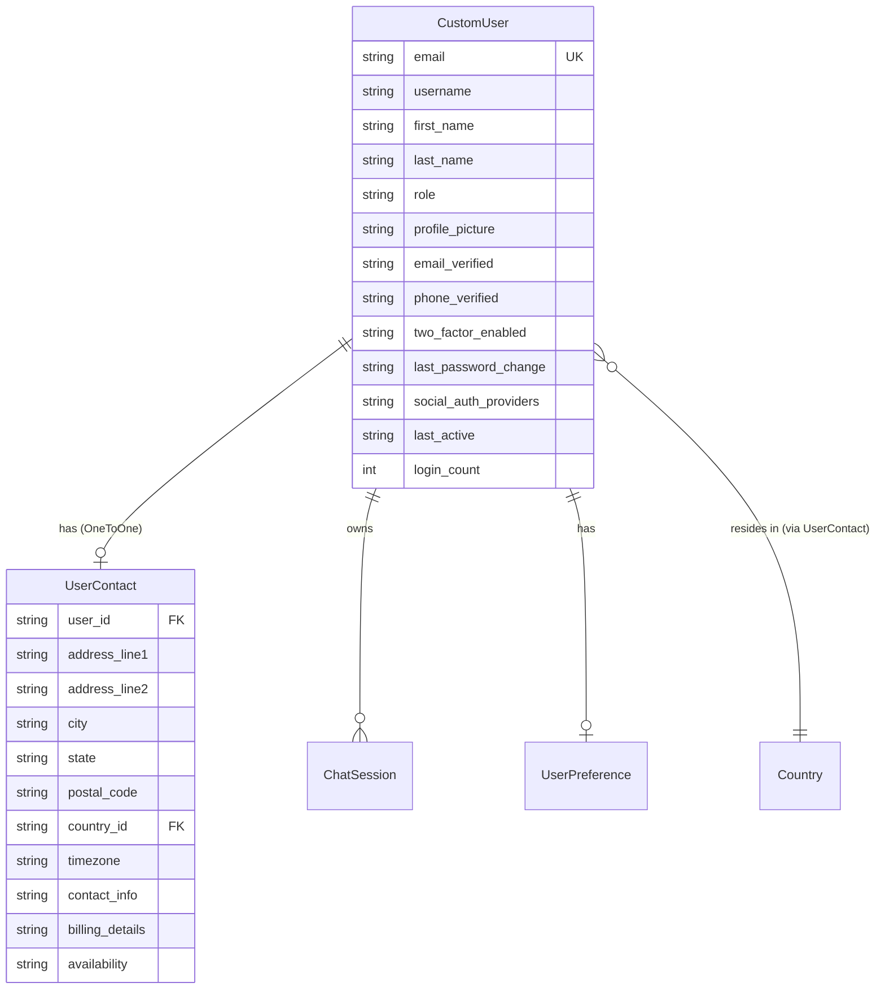
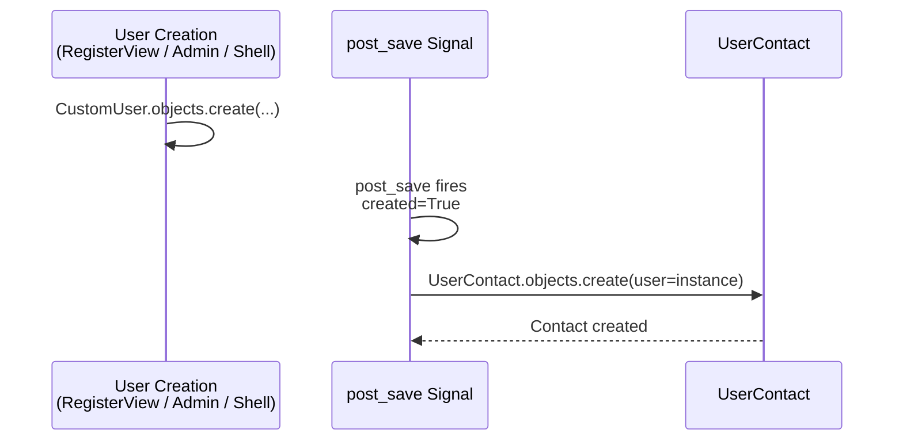

# Accounts App — Model Architecture

> **Crisp reference** for every model, field, relationship, index, signal, and design decision in the `accounts` app.

---

## Model Overview



---

## CustomUser

- **File:** `models/custom_user.py`
- **Extends:** `AbstractUser` (Django's built-in user base class)
- **Auth:** Email-based (`USERNAME_FIELD = "email"`)

### Why CustomUser?

Django's default `User` model uses `username` as the login field. Our app uses **email** — users don't think in usernames. We also need `role`, verification flags, and activity tracking that the default model doesn't provide.

> **Rule:** Always create a custom user model before the first migration. Switching later is extremely painful.

### Fields

| Field | Type | Constraints | Default | Purpose |
|-------|------|-------------|---------|---------|
| `email` | `EmailField` | `unique=True` | — | Primary identifier. `USERNAME_FIELD`. |
| `username` | `CharField` | (inherited) | — | Auto-generated if omitted. Still required by Django admin. |
| `first_name` | `CharField` | (inherited) | `""` | — |
| `last_name` | `CharField` | (inherited) | `""` | — |
| `password` | `CharField` | (inherited, hashed) | — | Django handles hashing. |
| `role` | `CharField(20)` | `choices=ROLE_CHOICES` | `"user"` | Access level: `"user"` or `"admin"`. |
| `profile_picture` | `ImageField` | `blank=True, null=True` | — | Uploaded to `avatars/`. Resized to 200x200. |
| `email_verified` | `BooleanField` | — | `False` | Set `True` after email verification flow. |
| `phone_verified` | `BooleanField` | — | `False` | Reserved for future phone verification. |
| `two_factor_enabled` | `BooleanField` | — | `False` | Reserved for 2FA toggle. |
| `last_password_change` | `DateTimeField` | `auto_now_add=True` | — | Timestamp of last password change. |
| `social_auth_providers` | `JSONField` | — | `helper.get_default_social_auth_providers` | Connected OAuth providers. |
| `last_active` | `DateTimeField` | `null=True, blank=True` | — | Updated on every authenticated request. |
| `login_count` | `PositiveIntegerField` | — | `0` | Incremented on each login. |

### Inherited Fields (from AbstractUser)

| Field | Type | Notes |
|-------|------|-------|
| `is_active` | `BooleanField` | Django's activation flag. `False` = user can't log in. |
| `is_staff` | `BooleanField` | Can access Django admin. |
| `is_superuser` | `BooleanField` | All permissions. |
| `date_joined` | `DateTimeField` | `auto_now_add=True`. |
| `last_login` | `DateTimeField` | Updated by Django on login. |
| `groups` | `ManyToManyField` | Overridden `related_name="customuser_set"`. |
| `user_permissions` | `ManyToManyField` | Overridden `related_name="customuser_set"`. |

### Role Choices

```python
ROLE_CHOICES = [
    ("user", "User"),           # Default. Own data only.
    ("admin", "Administrator"), # All data. Django admin access.
]
```

### Social Auth Default Structure

```python
# helper.get_default_social_auth_providers()
{
    "active_providers": [],     # e.g., ["google", "github"]
    "connections": {},          # provider → {id, email, name}
    "default_login": None       # preferred provider for one-click login
}
```

### Properties

| Property | Returns | Logic |
|----------|---------|-------|
| `full_name` | `str` | `f"{first_name} {last_name}"` if both exist, else `username` |
| `account_age_days` | `int` | `(now - date_joined).days` |
| `is_admin_user` | `bool` | `self.role == "admin"` |

### Methods

| Method | Signature | What It Does |
|--------|-----------|-------------|
| `update_last_active` | `(save: bool = True) -> None` | Sets `last_active = now()`. Optionally saves. |
| `verify_email` | `() -> bool` | Sets `email_verified = True`. Returns `False` if already verified. |

### Indexes (8 total)

| Index Name | Fields | Type | Why |
|-----------|--------|------|-----|
| `user_email_idx` | `email` | B-tree | Login lookup. Most frequent query. |
| `user_username_idx` | `username` | B-tree | Admin search. |
| `user_role_idx` | `role` | B-tree | Filter users by role. |
| `user_last_active_idx` | `last_active` | B-tree | Activity-based sorting. |
| `user_date_joined_idx` | `date_joined` | B-tree | Registration analytics. |
| `user_email_verified_idx` | `email_verified` | B-tree | Filter unverified users. |
| `user_verified_active_idx` | `email_verified, last_active` | B-tree (composite) | Engagement queries. |
| `user_social_auth_gin_idx` | `social_auth_providers` | GIN | JSON containment queries. |

### Meta

```python
class Meta:
    ordering = ["-date_joined"]   # Newest users first
    app_label = "accounts"
```

---

## UserContact

**File:** `models/custom_user.py`
**Extends:** `TimestampedModel` (adds `created_at`, `updated_at`)
**Relationship:** `OneToOne` to `CustomUser`

### Why a Separate Model?

Contact info is **optional** and **rarely accessed** on the login path. Keeping it in a separate table:
- Keeps `CustomUser` lean (auth queries are fast)
- Allows lazy loading (contact data fetched only when needed)
- Follows single-responsibility — auth ≠ address book

### Fields

| Field | Type | Constraints | Default | Purpose |
|-------|------|-------------|---------|---------|
| `user` | `OneToOneField` | `CASCADE, related_name="contact"` | — | Links to CustomUser. |
| `address_line1` | `CharField(255)` | `blank=True, null=True` | — | Street address. |
| `address_line2` | `CharField(255)` | `blank=True, null=True` | — | Apartment, suite, etc. |
| `city` | `CharField(100)` | `blank=True, null=True` | — | — |
| `state` | `CharField(100)` | `blank=True, null=True` | — | State/province. |
| `postal_code` | `CharField(20)` | `blank=True, null=True` | — | ZIP/postal code. |
| `country` | `ForeignKey(Country)` | `SET_DEFAULT, default=1` | `1` (US) | Reference data. |
| `timezone` | `CharField(100)` | `blank=True, null=True` | — | e.g., `"Asia/Kolkata"`. |
| `contact_info` | `JSONField` | — | `helper.get_default_user_contact_info` | Phone, social, emergency. |
| `billing_details` | `JSONField` | `blank=True, null=True` | `dict` | Invoicing info. |
| `availability` | `JSONField` | `blank=True, null=True` | `dict` | Schedule info. |

### Contact Info Default Structure

```python
# helper.get_default_user_contact_info()
{
    "phone": {
        "primary": None,
        "secondary": None,
        "verified": False
    },
    "social": {
        "linkedin": None,
        "twitter": None,
        "github": None,
        "custom": []          # [{name, url}]
    },
    "emergency_contact": {
        "name": None,
        "relationship": None,
        "phone": None
    }
}
```

### Indexes (4 total)

| Index Name | Fields | Type | Why |
|-----------|--------|------|-----|
| `user_contact_user_idx` | `user` | B-tree | OneToOne lookup. |
| `user_contact_info_gin_idx` | `contact_info` | GIN | JSON queries on phone/social. |
| `user_billing_gin_idx` | `billing_details` | GIN | Billing JSON queries. |
| `user_availability_gin_idx` | `availability` | GIN | Schedule JSON queries. |

---

## Signal: Auto-Create UserContact

**File:** `signals/user_creation_signals.py`



| Detail | Value |
|--------|-------|
| **Signal** | `post_save` |
| **Sender** | `CustomUser` |
| **Condition** | `created=True` (new user only, not updates) |
| **Action** | Creates `UserContact` with default values |
| **Transaction** | Wrapped in `atomic()` for safety |
| **Error handling** | `IntegrityError` → skip (already exists). Other errors → log and continue. |
| **Country fallback** | If no `Country` exists, creates a default "United States" entry. |

> **Why a signal?** Every new user needs a contact record. The signal guarantees this regardless of how the user is created (API, admin, shell, test fixture). No calling code needs to remember to create it.

---

## Admin Configuration

**File:** `admin/user_admin.py`

### CustomUserAdmin

| Feature | Configuration |
|---------|--------------|
| **Inline** | `UserContactInline` (StackedInline, can't delete) |
| **List display** | email, username, full_name, role, email_verified, is_active, last_active, date_joined |
| **List filters** | role, email_verified, phone_verified, two_factor_enabled, is_active, is_staff, is_superuser, date_joined, last_active |
| **Search fields** | email, username, first_name, last_name |
| **Ordering** | `-date_joined` |
| **Date hierarchy** | `date_joined` |
| **Readonly** | account_age_days, last_password_change, date_joined, last_login, login_count |

**6 Fieldsets:**

| # | Fieldset | Fields | Collapsed? |
|---|----------|--------|-----------|
| 1 | Basic Information | email, username, first_name, last_name, password | No |
| 2 | Role & Permissions | role, is_active, is_staff, is_superuser, groups, user_permissions | No |
| 3 | Profile | profile_picture | No |
| 4 | Verification & Security | email_verified, phone_verified, two_factor_enabled, last_password_change | Yes |
| 5 | Social Authentication | social_auth_providers | Yes |
| 6 | Activity & Engagement | last_active, login_count, date_joined, last_login, account_age_days | Yes |

**3 Admin Actions:**

| Action | What It Does |
|--------|-------------|
| `activate_users` | `queryset.update(is_active=True)` |
| `deactivate_users` | `queryset.update(is_active=False)` |
| `verify_emails` | `queryset.update(email_verified=True)` |

---

## Design Decisions

| Decision | Why |
|----------|-----|
| **Email as USERNAME_FIELD** | Users remember emails, not usernames. Reduces support tickets. |
| **Separate UserContact model** | Auth table stays lean. Contact data is optional and rarely queried on login. |
| **Signal for auto-creation** | Guarantees UserContact exists regardless of creation path (API, admin, shell). |
| **GIN indexes on JSONFields** | PostgreSQL JSON containment queries (`@>`, `?`) need GIN for performance. |
| **Composite index on (email_verified, last_active)** | Engagement queries ("active verified users") are common in analytics. |
| **role as CharField, not ForeignKey** | Only 2 values. A separate table would add an unnecessary JOIN. |
| **Overridden groups/user_permissions related_name** | Avoids reverse accessor clash with `auth.User` if it still exists in migrations. |
| **login_count on CustomUser** | Denormalized for performance — avoids COUNT query on auth logs. |