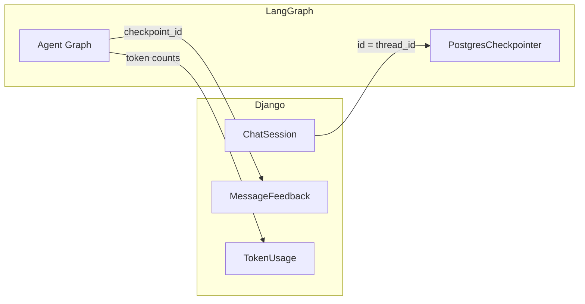

# Chatbot App

> AI conversation engine — sessions, feedback, prompts, documents, tools, and token tracking for the chatbot platform.

---

## What This App Does

The `chatbot` app is the **AI layer** of the platform. It manages conversation sessions, connects Django to LangGraph, handles user feedback on AI responses, and provides configuration for prompts, tools, and API keys.

```
┌─────────────────────────────────────────────────────────────────────┐
│                        chatbot app                                  │
│                                                                     │
│  ┌──────────────┐  ┌──────────────┐  ┌───────────────────────────┐ │
│  │  Models (8)  │  │  ViewSets(9) │  │  Services (9)             │ │
│  │              │  │              │  │                           │ │
│  │ ChatSession  │  │ ChatAgent    │  │ agent_service             │ │
│  │ MsgFeedback  │  │ ChatSession  │  │ chat_session_service      │ │
│  │ SysPrompt    │  │ MsgFeedback  │  │ message_service           │ │
│  │ TokenUsage   │  │ SysPrompt    │  │ summarization_service     │ │
│  │ UserDoc      │  │ TokenUsage   │  │ token_usage_service       │ │
│  │ UserPref     │  │ UserDoc      │  │ document_processing_svc   │ │
│  │ UserTool     │  │ UserPref     │  │ vector_storage_service    │ │
│  │ UserAPIKey   │  │ UserTool     │  │ api_key_service           │ │
│  └──────────────┘  │ UserAPIKey   │  │ tool_service              │ │
│                    └──────────────┘  │ user_preference_service    │ │
│  ┌──────────────┐  ┌──────────────┐  └───────────────────────────┘ │
│  │  Consumer    │  │  Serializers │                                 │
│  │              │  │  (9 files)   │                                 │
│  │ chat_consumer│  │              │                                 │
│  └──────────────┘  └──────────────┘                                 │
└─────────────────────────────────────────────────────────────────────┘
```

---

## Quick Reference

### Models

| Model | Purpose | Key Detail |
|-------|---------|-----------|
| `ChatSession` | Conversation metadata | UUID PK = LangGraph thread_id. State machine: active → archived → soft-deleted. |
| `MessageFeedback` | User ratings on AI responses | Linked via `(checkpoint_id, message_index)`. Admin review workflow. |
| `SystemPromptTemplate` | Reusable system prompts | Variable substitution `{role}`. Usage + rating analytics. |
| `TokenUsage` | Token consumption tracking | Append-only ledger. Cost calculated at write time. `create_from_response()` factory. |
| `UserDocument` | RAG document uploads | File metadata in Django, embeddings in pgvector. Processing state machine with 3 retries. |
| `UserPreference` | AI behavior defaults | OneToOne to user. `PREFERENCE_DEFAULTS` constant. Feeds `ChatSession.create_for_user()`. |
| `UserTool` | Tool configuration | `TOOL_REGISTRY` in code (not DB). User overrides merge with defaults. |
| `UserAPIKey` | External API keys | Fernet-encrypted at rest. `key_prefix` for UI. Provider validation via API call. |

→ Model architecture docs:
- [ChatSession](./chat_session_architecture.md)
- [MessageFeedback](./message_feedback_architecture.md)
- [SystemPromptTemplate](./system_prompt_architecture.md)
- [TokenUsage](./token_usage_architecture.md)
- [UserAPIKey](./user_api_key_architecture.md)
- [UserDocument](./user_document_architecture.md)
- [UserPreference](./user_preference_architecture.md)
- [UserTool](./user_tool_architecture.md)

### Endpoints (9 resource groups)

| Prefix | ViewSet | Purpose |
|--------|---------|---------|
| `chat-agent/` | `ChatAgentViewSet` | Send messages, stream responses |
| `chat-sessions/` | `ChatSessionViewSet` | CRUD + archive/pin/activate |
| `preferences/` | `UserPreferenceViewSet` | User AI preferences |
| `message-feedback/` | `MessageFeedbackViewSet` | Submit + review feedback |
| `token-usage/` | `TokenUsageViewSet` | Token consumption analytics |
| `documents/` | `UserDocumentViewSet` | Upload + manage RAG docs |
| `system-prompts/` | `SystemPromptViewSet` | Template CRUD + search |
| `tools/` | `UserToolViewSet` | Tool enable/disable |
| `api-keys/` | `UserAPIKeyViewSet` | API key management |

All mounted at `/api/v1/chatbot/` via `DefaultRouter`.

---

## Architecture: Django ↔ LangGraph Bridge

The chatbot app's defining pattern is the **dual-store architecture**: Django owns metadata, LangGraph owns conversation state.



| What | Stored In | Why |
|------|-----------|-----|
| Session title, tags, pinned, archived | Django (ChatSession) | User-facing metadata. Fast sidebar queries. |
| Messages, conversation state, checkpoints | LangGraph (Checkpointer) | Agent needs full state. Replaying, branching. |
| Feedback, ratings | Django (MessageFeedback) | Analytics. Admin review. Not needed by agent. |
| Token counts | Django (TokenUsage) | Billing, dashboards. Aggregated from LangGraph callbacks. |

---

## Directory Structure

```
chatbot/
├── apps.py                              # AppConfig
├── routing.py                           # WebSocket URL routing
├── models/
│   ├── __init__.py                       # Exports all 8 models
│   ├── chat_session.py                   # ChatSession
│   ├── message_feedback.py              # MessageFeedback
│   ├── system_prompt.py                  # SystemPromptTemplate
│   ├── token_usage.py                    # TokenUsage
│   ├── user_document.py                  # UserDocument
│   ├── user_preference.py               # UserPreference
│   ├── user_tool.py                      # UserTool
│   └── user_api_key.py                   # UserAPIKey
├── api/
│   ├── urls.py                           # Router registration (9 ViewSets)
│   ├── views/
│   │   ├── chat_agent_views.py           # Streaming chat endpoint
│   │   ├── chat_session_views.py         # Session CRUD + actions
│   │   ├── message_feedback_views.py     # Feedback submit + admin review
│   │   ├── system_prompt_views.py        # Template CRUD + search
│   │   ├── token_usage_views.py          # Usage analytics
│   │   ├── user_document_views.py        # Document upload + RAG
│   │   ├── user_preference_views.py      # Preference CRUD
│   │   ├── user_tool_views.py            # Tool config
│   │   └── user_api_key_views.py         # API key management
│   └── serializers/
│       ├── chat_agent_serializers.py
│       ├── chat_session_serializers.py
│       ├── message_feedback_serializers.py
│       ├── system_prompt_serializers.py
│       ├── token_usage_serializers.py
│       ├── user_document_serializers.py
│       ├── user_preference_serializers.py
│       ├── user_tool_serializers.py
│       └── user_api_key_serializers.py
├── services/
│   ├── agent_service.py                  # LangGraph agent orchestration
│   ├── chat_session_service.py           # Session business logic
│   ├── message_service.py                # Message handling
│   ├── summarization_service.py          # Auto-summarization
│   ├── token_usage_service.py            # Token tracking
│   ├── document_processing_service.py    # File parsing + chunking
│   ├── vector_storage_service.py         # pgvector operations
│   ├── api_key_service.py                # Key encryption/decryption
│   ├── tool_service.py                   # Tool registration
│   └── user_preference_service.py        # Preference defaults
├── consumers/
│   └── chat_consumer.py                  # WebSocket chat handler
├── admin/
│   └── __init__.py
├── management/
│   └── commands/                         # Custom management commands
├── docs/
│   ├── chat_session_architecture.md      # ChatSession model reference
│   ├── message_feedback_architecture.md   # MessageFeedback model reference
│   └── system_prompt_architecture.md     # SystemPromptTemplate model reference
└── tests/
    ├── test_models.py
    ├── test_api_viewsets.py
    ├── test_serializers.py
    ├── test_agent_service.py
    ├── _mixins.py                         # Test factories + helpers
    └── TESTING.md
```

---

## Key Patterns

### 1. UUID as Bridge Key

```python
class ChatSession(TimestampedModel):
    id = models.UUIDField(primary_key=True, default=uuid.uuid4)

    @property
    def thread_id(self):
        return str(self.id)  # ← This IS the LangGraph thread_id
```

No mapping table. No sync job. One ID, two systems.

### 2. LangGraph Coordinates for Feedback

```python
class MessageFeedback(TimestampedModel):
    checkpoint_id = models.CharField(...)   # LangGraph checkpoint
    message_index = models.IntegerField(...) # Nth message in checkpoint
    # NOT a FK to a Message model — messages live in checkpointer
```

### 3. Template Variable Substitution

```python
template = SystemPromptTemplate.objects.get(slug="coding-assistant")
rendered = template.render({"language": "Python", "level": "senior"})
# "You are a senior Python developer..."
```

### 4. Service Layer (CSR Pattern)

ViewSets are thin — business logic lives in `services/`:

```
ViewSet → Service → Model/Repository
```

Example: `ChatSessionViewSet` → `chat_session_service.create_session()` → `ChatSession.create_for_user()`

### 5. WebSocket Chat

Real-time streaming via Django Channels:

```
WebSocket /ws/chat/{session_id}/ → ChatConsumer → agent_service.stream()
```

---

## Dependencies

| Dependency | Purpose |
|-----------|---------|
| `langgraph` | Agent graph orchestration + checkpointer |
| `langchain-openai` | OpenAI/Anthropic LLM integration |
| `psycopg2` | PostgreSQL + pgvector |
| `pgvector` | Vector similarity search for RAG |
| `channels` | WebSocket support (Daphne) |
| `celery` | Async tasks (summarization, document processing) |
| `cryptography` | API key encryption at rest |
| `drf-spectacular` | OpenAPI schema generation |

---

## Related Docs

| Doc | Location |
|-----|----------|
| ChatSession architecture | [chat_session_architecture.md](./chat_session_architecture.md) |
| MessageFeedback architecture | [message_feedback_architecture.md](./message_feedback_architecture.md) |
| SystemPromptTemplate architecture | [system_prompt_architecture.md](./system_prompt_architecture.md) |
| TokenUsage architecture | [token_usage_architecture.md](./token_usage_architecture.md) |
| UserAPIKey architecture | [user_api_key_architecture.md](./user_api_key_architecture.md) |
| UserDocument architecture | [user_document_architecture.md](./user_document_architecture.md) |
| UserPreference architecture | [user_preference_architecture.md](./user_preference_architecture.md) |
| UserTool architecture | [user_tool_architecture.md](./user_tool_architecture.md) |
| Web Architecture Fundamentals | [00_web_architecture_fundamentals.md](../../../local_folder/tutorials/01_overview/00_web_architecture_fundamentals.md) |
| Django Request-Response + MVT | [01_django_request_response_mvt.md](../../../local_folder/tutorials/01_overview/01_django_request_response_mvt.md) |
| JWT Deep Dive | [02_authentication_jwt_deep_dive.md](../../../local_folder/tutorials/01_overview/02_authentication_jwt_deep_dive.md) |
| Accounts App | [accounts/docs/README.md](../accounts/docs/README.md) |
| LangGraph + Postgres | [langgraph_postgres_checkpointer.md](../../docs/langgraph_postgres_checkpointer.md) |