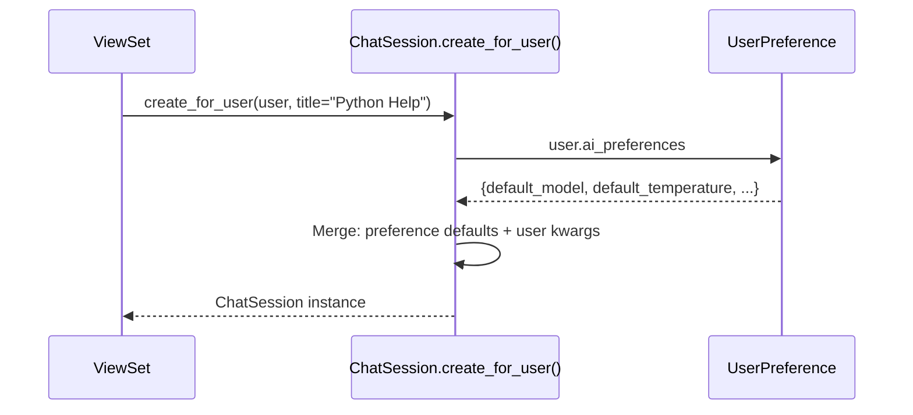

# ChatSession — Model Architecture

> The core domain model. Maps user conversations to LangGraph threads.

---

## The Key Insight

**ChatSession does NOT store messages.** It stores *metadata* about conversations. The actual messages live in LangGraph's PostgresCheckpointer. The `ChatSession.id` doubles as the LangGraph `thread_id` — that's the bridge between Django and LangGraph. This is not duplication — each system owns what it's best at: Django owns user-facing metadata (title, tags, pinned, archived) for fast sidebar queries; LangGraph owns conversation state (messages, checkpoints, agent memory) for replay and branching. No overlap. The only sync is lightweight and one-directional: LangGraph → Django for denormalized counters (`message_count`, `last_message_at`) via `update_analytics()`.

```
┌──────────────────────┐         ┌──────────────────────────────┐
│   ChatSession        │         │   LangGraph Checkpointer     │
│   (Django / PG)      │         │   (Separate PG tables)       │
│                      │         │                              │
│   id = thread_id ────┼────────►│   thread_id = id             │
│   title, tags, etc.  │         │   messages, checkpoints      │
└──────────────────────┘         └──────────────────────────────┘
```

---

## Fields

| Field | Type | Default | Purpose |
|-------|------|---------|---------|
| `id` | `UUIDField (PK)` | `uuid.uuid4` | Primary key. **Also = LangGraph thread_id.** |
| `user` | `FK → CustomUser` | — | Session owner. `CASCADE` delete. `related_name="chat_sessions"` |
| `title` | `CharField(255)` | `"New Conversation"` | User-defined or auto-generated. |
| `description` | `TextField` | `null` | Optional summary. |
| `model_name` | `CharField(100)` | `"gpt-5-mini"` | AI model for this session. |
| `temperature` | `FloatField` | `0.7` | Model temperature (0.0–2.0). |
| `enable_summarization` | `BooleanField` | `True` | Auto-summarize long conversations. |
| `summarization_threshold` | `IntegerField` | `384` | Token count to trigger summarization. |
| `is_active` | `BooleanField` | `True` | Visible in user's session list. |
| `is_archived` | `BooleanField` | `False` | Hidden from active list. |
| `is_pinned` | `BooleanField` | `False` | Pinned to top of sidebar. |
| `tags` | `JSONField` | `list` | User-defined tags. `["python", "debug"]` |
| `metadata` | `JSONField` | `dict` | Extra session metadata. |
| `message_count` | `IntegerField` | `0` | Updated via signals/Celery. |
| `total_tokens_used` | `IntegerField` | `0` | Cumulative token consumption. |
| `last_message_at` | `DateTimeField` | `null` | Timestamp of last message. |

**Inherited from `TimestampedModel`:** `created_at`, `updated_at`

---

## Indexes (4)

| Name | Fields | Why |
|------|--------|-----|
| `chatsession_user_lastmsg_idx` | `user, -last_message_at` | User's session list sorted by recent. |
| `chatsession_user_active_idx` | `user, is_active` | Filter active sessions per user. |
| `chatsession_user_archived_idx` | `user, is_archived` | Filter archived sessions per user. |
| `chatsession_pinned_idx` | `is_pinned, -last_message_at` | Pinned sessions first. |

**Default ordering:** `-is_pinned, -last_message_at, -updated_at` (pinned + recent first)

---

## Properties

| Property | Returns | Logic |
|----------|---------|-------|
| `thread_id` | `str` | `str(self.id)` — for LangGraph config. |
| `is_new` | `bool` | `self.message_count == 0` |
| `title_preview` | `str` | Title truncated to 50 chars with `...` |

---

## Instance Methods — State Transitions

| Method | What It Does | Fields Updated |
|--------|-------------|---------------|
| `archive()` | Archive + deactivate | `is_archived=True, is_active=False` |
| `activate()` | Reactivate archived session | `is_archived=False, is_active=True` |
| `toggle_pin()` | Flip pin status | `is_pinned` toggled |
| `soft_delete()` | Archive + clear metadata | `is_active=False, is_archived=True, metadata={}, tags=[]` |
| `update_title(first_message)` | Auto-title from first message | `title` (only if still "New Conversation") |
| `update_analytics(msg_count, tokens)` | Increment counters + timestamp | `message_count, total_tokens_used, last_message_at` |

### State Machine

```
                 create()
                    │
                    ▼
              ┌───────────┐
              │  ACTIVE   │◄──── activate()
              │           │
              │ is_active │
              │ !archived │
              └─────┬─────┘
                    │
          archive() │        soft_delete()
                    │              │
                    ▼              ▼
              ┌───────────┐  ┌───────────────┐
              │ ARCHIVED  │  │ SOFT DELETED  │
              │           │  │               │
              │ !active   │  │ !active       │
              │ archived  │  │ archived      │
              └───────────┘  │ metadata={}   │
                             │ tags=[]       │
                             └───────────────┘
```

---

## Instance Methods — LangGraph Integration

### `get_langgraph_config()`

Returns the config dict for LangGraph's `agent.invoke()`:

```python
config = session.get_langgraph_config()
# → {"configurable": {"thread_id": "550e8400-e29b-..."}}

response = agent.invoke({"messages": [msg]}, config)
```

### `get_analytics_summary()`

Returns a dict combining session counters + TokenUsage aggregate:

```python
{
    "session_id": "550e8400-...",
    "title": "Python Help",
    "message_count": 12,
    "total_tokens": 4500,
    "total_cost": 0.23,        # from TokenUsage aggregate
    "created_at": "...",
    "last_message_at": "...",
    "is_active": true,
    "is_archived": false,
}
```

---

## Class Methods — Queryset Helpers

| Method | Returns | Purpose |
|--------|---------|---------|
| `get_active_for_user(user)` | QuerySet | Active + non-archived, pinned first. |
| `get_archived_for_user(user)` | QuerySet | Archived only, by updated_at. |
| `get_pinned_for_user(user)` | QuerySet | Pinned + active, by last_message_at. |
| `get_session_stats(user)` | dict | Aggregate: total, active, archived, messages, tokens. |
| `create_for_user(user, preferences, **kwargs)` | ChatSession | Create with UserPreference defaults. |
| `cleanup_old_sessions(days_inactive=90)` | int | Archive stale sessions. Returns count. |

### `create_for_user()` — Preference Defaults Flow



---

## Design Decisions

| Decision | Why |
|----------|-----|
| **UUID as PK = thread_id** | Single source of truth. No mapping table needed between Django and LangGraph. |
| **No messages in Django** | LangGraph checkpointer already stores them. Duplicating would be a sync nightmare. |
| **Soft delete, not hard delete** | User data should be recoverable. Analytics still need the record. |
| **Denormalized message_count** | Avoids COUNT query on every sidebar load. Updated via signals. |
| **Ordering: pinned first** | `-is_pinned, -last_message_at` — pinned sessions always at top. |
| **create_for_user() class method** | Centralizes preference-default logic. ViewSets call one method. |