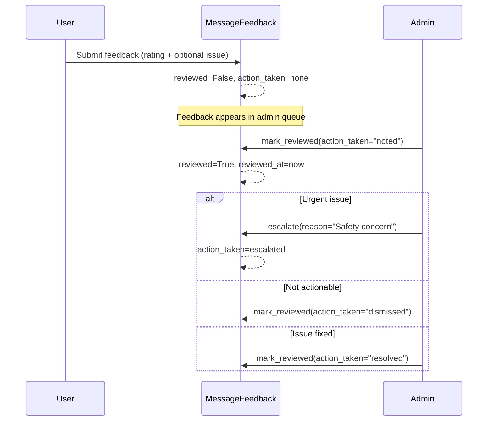

# MessageFeedback — Model Architecture

> Captures user sentiment on AI responses. Bridges Django feedback to LangGraph checkpoints.

---

## The Key Insight

**MessageFeedback locates a message via LangGraph coordinates, not a Django FK.** The pair `(checkpoint_id, message_index)` uniquely identifies a message inside a LangGraph thread. This means feedback survives even if we restructure how messages are stored — we're pointing at the *checkpoint*, not a row.

```
┌──────────────────────────┐
│   MessageFeedback        │
│                          │
│   checkpoint_id ─────────┼──► LangGraph checkpoint
│   message_index ─────────┼──► Nth message in that checkpoint
│                          │
│   user ──────────────────┼──► Who gave feedback
│   chat_session ─────────┼──► Which session
└──────────────────────────┘
```

---

## Fields

| Field | Type | Default | Purpose |
|-------|------|---------|---------|
| `id` | `BigAutoField (PK)` | auto | Surrogate key. |
| `user` | `FK → CustomUser` | — | Feedback giver. `CASCADE`. `related_name="message_feedbacks"` |
| `chat_session` | `FK → ChatSession` | — | Session context. `CASCADE`. `related_name="feedbacks"` |
| `checkpoint_id` | `CharField(255)` | — | LangGraph checkpoint identifier. |
| `message_index` | `IntegerField` | — | Message position within checkpoint (0-based). |
| `rating` | `CharField(20)` | — | User's rating. See choices below. |
| `feedback_categories` | `JSONField` | `list` | Structured categories. `["accuracy", "tone"]` |
| `feedback_text` | `TextField` | `""` | Free-form comment. |
| `reported_issue` | `CharField(30)` | `"none"` | Issue type. See choices below. |
| `message_preview` | `TextField` | `""` | Snippet of the AI message being rated. |
| `model_used` | `CharField(100)` | `""` | AI model that generated the response. |
| `reviewed` | `BooleanField` | `False` | Admin has reviewed this feedback. |
| `reviewed_at` | `DateTimeField` | `null` | When admin reviewed. |
| `reviewed_by` | `FK → CustomUser` | `null` | Admin who reviewed. `SET_NULL`. |
| `admin_notes` | `TextField` | `""` | Internal admin notes. |
| `action_taken` | `CharField(20)` | `"none"` | Admin action. See choices below. |

**Inherited from `TimestampedModel`:** `created_at`, `updated_at`

---

## Choice Fields

### Rating (7 options)

| Value | Sentiment | Group |
|-------|-----------|-------|
| `thumbs_up` | Positive | Quick |
| `thumbs_down` | Negative | Quick |
| `excellent` | Positive | Detailed |
| `good` | Positive | Detailed |
| `neutral` | Neutral | Detailed |
| `poor` | Negative | Detailed |
| `very_poor` | Negative | Detailed |

### Reported Issue (7 options)

| Value | Meaning |
|-------|---------|
| `none` | No issue |
| `inaccurate` | Factually wrong |
| `offensive` | Inappropriate content |
| `irrelevant` | Off-topic |
| `hallucination` | Made-up information |
| `formatting` | Display/rendering issue |
| `other` | Catch-all |

### Action Taken (5 options)

| Value | Meaning |
|-------|---------|
| `none` | No action yet |
| `noted` | Acknowledged, no change |
| `escalated` | Sent for urgent review |
| `resolved` | Issue fixed |
| `dismissed` | Not actionable |

---

## Constraints & Indexes

**`unique_together = [checkpoint_id, message_index, user]`** — One feedback per user per message.

| Name | Fields | Why |
|------|--------|-----|
| `msgfb_session_checkpoint_idx` | `chat_session, checkpoint_id` | Feedback per session checkpoint. |
| `msgfb_user_rating_idx` | `user, rating` | User's feedback by rating type. |
| `msgfb_reviewed_idx` | `reviewed` | Filter unreviewed feedback. |
| `msgfb_reported_idx` | `reported_issue` | Filter by issue type. |
| `msgfb_created_idx` | `-created_at` | Chronological listing. |

**Default ordering:** `-created_at`

---

## Properties

| Property | Returns | Logic |
|----------|---------|-------|
| `is_positive` | `bool` | `rating in ["thumbs_up", "excellent", "good"]` |
| `is_negative` | `bool` | `rating in ["thumbs_down", "poor", "very_poor"]` |
| `is_neutral` | `bool` | `rating == "neutral"` |
| `has_issue_report` | `bool` | `reported_issue != "none"` |
| `sentiment_score` | `float` | Maps rating → numeric: `thumbs_up=1.0, excellent=0.8, good=0.6, neutral=0.0, poor=-0.6, very_poor=-0.8, thumbs_down=-1.0` |

---

## Instance Methods

| Method | What It Does | Fields Updated |
|--------|-------------|---------------|
| `mark_reviewed(reviewer, action_taken, admin_notes)` | Mark as admin-reviewed | `reviewed, reviewed_at, reviewed_by, action_taken, admin_notes` |
| `escalate(escalated_by, reason)` | Escalate for urgent review | `action_taken="escalated", reviewed=True, reviewed_at, reviewed_by, admin_notes="[ESCALATED] {reason}"` |
| `to_display_dict()` | Serializable dict for API | All key fields + computed properties |

---

## Class Methods — Analytics

| Method | Returns | Purpose |
|--------|---------|---------|
| `get_session_satisfaction(session)` | dict | Per-session: total, positive, negative, neutral, satisfaction_rate. |
| `get_user_satisfaction(user)` | dict | Per-user: total, positive, satisfaction_rate. |
| `get_overall_satisfaction()` | dict | Platform-wide: total, positive, negative, neutral, satisfaction_rate. Uses `Count + Q` aggregates. |

### Satisfaction Rate Calculation

```
satisfaction_rate = (positive_count / total_count) * 100
```

Where **positive** = ratings in `["thumbs_up", "excellent", "good"]`.

---

## Admin Review Workflow



---

## Design Decisions

| Decision | Why |
|----------|-----|
| **LangGraph coordinates, not message FK** | Messages live in checkpointer. Using `(checkpoint_id, message_index)` decouples feedback from Django message storage. |
| **unique_together on (checkpoint_id, message_index, user)** | Prevents duplicate feedback. One rating per user per message. |
| **7-level rating scale** | Quick (thumbs) + detailed (5-point) covers both casual and thorough users. |
| **Admin review fields on same model** | Avoids a separate Review model. Feedback + review is 1:1 — no need for extra table. |
| **Denormalized `model_used`** | Avoids JOIN back to ChatSession for analytics queries filtered by model. |
| **`sentiment_score` as property** | Computed on read, not stored. Ratings change rarely; no need to persist. |
| **`escalate()` as separate method** | Sets `action_taken="escalated"` + auto-prefixes admin_notes. Distinct from generic `mark_reviewed()`. |