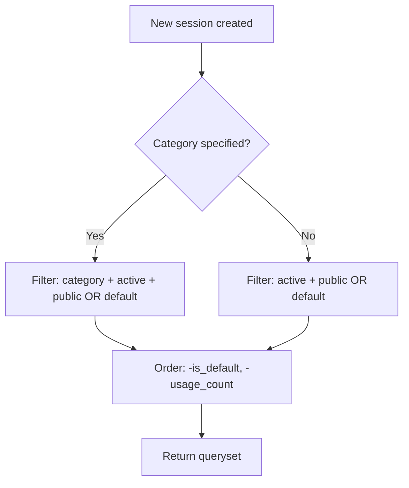
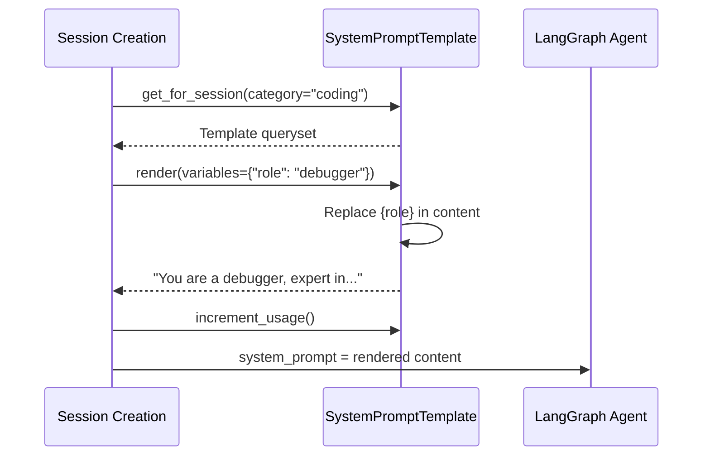

# SystemPromptTemplate — Model Architecture

> Reusable, templatized system prompts with variable substitution and analytics.

---

## The Key Insight

**SystemPromptTemplate is a template engine, not just a text store.** It supports `{variable}` placeholders, validates them, renders them, and tracks usage/ratings. Think of it as "Jinja for system prompts" — but stored in the DB so admins can manage prompts without code deploys.

```
┌─────────────────────────────────────────────┐
│  Template: "You are {role}, expert in {topic}"│
│                                             │
│  variables: ["role", "topic"]               │
│  example_variables: {"role": "tutor",       │
│                       "topic": "Python"}     │
│                                             │
│  render({"role": "tutor", "topic": "Django"})│
│  → "You are a tutor, expert in Django"      │
└─────────────────────────────────────────────┘
```

---

## Fields

| Field | Type | Default | Purpose |
|-------|------|---------|---------|
| `id` | `BigAutoField (PK)` | auto | Surrogate key. |
| `name` | `CharField(255)` | — | Unique human-readable name. |
| `slug` | `SlugField(255)` | — | URL-friendly unique identifier. |
| `content` | `TextField` | — | The system prompt text. Supports `{variable}` placeholders. |
| `description` | `TextField` | `null` | What this prompt does. |
| `category` | `CharField(50)` | `"general"` | Classification. See choices below. |
| `tags` | `JSONField` | `list` | Search/organization tags. `["python", "debug"]` |
| `is_default` | `BooleanField` | `False` | The default prompt for new sessions. |
| `is_active` | `BooleanField` | `True` | Available for use. |
| `is_public` | `BooleanField` | `False` | Visible to all users (vs. creator-only). |
| `variables` | `JSONField` | `list` | Declared variable names. `["role", "topic"]` |
| `example_variables` | `JSONField` | `dict` | Sample values for docs/preview. `{"role": "tutor"}` |
| `recommended_model` | `CharField(100)` | `null` | Best AI model for this prompt. |
| `recommended_temperature` | `FloatField` | `null` | Suggested temperature. |
| `usage_count` | `IntegerField` | `0` | Times used. Incremented via `increment_usage()`. |
| `rating_sum` | `IntegerField` | `0` | Sum of all star ratings. |
| `rating_count` | `IntegerField` | `0` | Number of ratings received. |

**Inherited from `TimestampedModel`:** `created_at`, `updated_at`

---

## Category Choices (9)

| Value | Label |
|-------|-------|
| `general` | General Purpose |
| `coding` | Coding Assistant |
| `writing` | Writing Helper |
| `research` | Research Assistant |
| `education` | Educational |
| `business` | Business/Professional |
| `creative` | Creative Writing |
| `analysis` | Data Analysis |
| `custom` | Custom |

---

## Indexes (3)

| Name | Fields | Why |
|------|--------|-----|
| `sysprompt_cat_active_idx` | `category, is_active` | Filter by category + active status. |
| `sysprompt_default_idx` | `is_default` | Fast lookup for default template. |
| `sysprompt_usage_idx` | `-usage_count` | Popular templates first. |

**Default ordering:** `-is_default, -usage_count, name` (default first, then popular, then alphabetical)

---

## Properties

| Property | Returns | Logic |
|----------|---------|-------|
| `average_rating` | `float` | `rating_sum / rating_count` (0.0 if no ratings). Rounded to 2 decimals. |
| `has_variables` | `bool` | `bool(self.variables)` — template uses placeholders. |

---

## Instance Methods

### Variable Handling

| Method | Returns | What It Does |
|--------|---------|-------------|
| `render(variables=None)` | `str` | Replace `{key}` with values. Returns content with placeholders filled. |
| `get_unfilled_variables()` | `list[str]` | Parse `{variable}` patterns from content via regex. Returns unique set. |
| `validate_variables(provided)` | `dict` | Check if all required variables are provided. Returns `{valid, missing, extra}`. |

### Usage & Rating

| Method | Returns | What It Does |
|--------|---------|-------------|
| `increment_usage()` | — | `usage_count += 1`. Call when session uses this template. |
| `add_rating(value)` | `float` | Add 1–5 star rating. Updates `rating_sum`, `rating_count`. Returns new average. Raises `ValueError` if not 1–5. |

### Lifecycle

| Method | Returns | What It Does |
|--------|---------|-------------|
| `duplicate(new_name=None, user=None)` | `SystemPromptTemplate` | Clone template. `is_default=False, is_public=False`. Auto-slugs new name. |
| `to_display_dict()` | `dict` | Serializable dict for API responses. Includes computed `average_rating`, `has_variables`. |

---

## Class Methods

| Method | Returns | Purpose |
|--------|---------|---------|
| `get_default()` | `SystemPromptTemplate or None` | The active default template. Used when user doesn't pick one. |
| `get_public_templates()` | QuerySet | All public + active templates. |
| `get_by_category(category)` | QuerySet | Active templates in a category. |
| `get_for_session(category=None)` | QuerySet | Templates available for new session: public OR default, active. Optional category filter. |
| `search_templates(query)` | QuerySet | Search name, description, content (icontains). Active only, ordered by usage. |

### `get_for_session()` — Template Selection Logic



---

## Variable Substitution Flow



---

## Design Decisions

| Decision | Why |
|----------|-----|
| **Variables in JSONField, not separate model** | Variable names are metadata, not relational data. A separate Variable model would add JOINs for no benefit. |
| **`render()` uses simple str.replace** | System prompts don't need Jinja's complexity. `{variable}` is unambiguous and safe. |
| **`validate_variables()` returns `{valid, missing, extra}`** | Frontend needs to know *which* variables are missing, not just "invalid". |
| **`is_default` flag, not separate table** | Only one default exists. A flag + index is simpler than a config table. |
| **Denormalized `usage_count`** | Avoids COUNT query on every template list. Incremented atomically. |
| **`rating_sum` + `rating_count` instead of Rating model** | Average rating is all we need. A separate Rating FK would add a table for minimal gain. |
| **`duplicate()` never copies `is_default`** | Prevents two defaults. Explicit safety in the method. |
| **`search_templates()` searches content too** | Users remember what a prompt says, not just its name. |