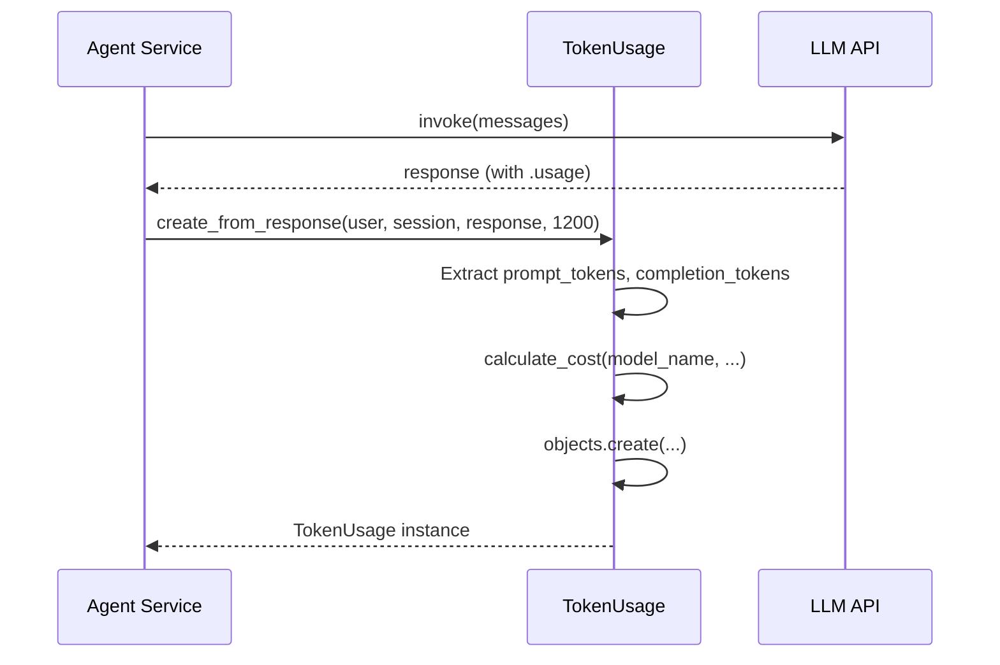

# TokenUsage — Model Architecture

> Tracks AI token consumption and costs per request. The billing and analytics backbone.

---

## The Key Insight

**TokenUsage is an append-only ledger.** Every LLM API call creates one row. Costs are calculated at write time from a pricing table — never recomputed later. This makes aggregation queries fast and auditable.

```
┌──────────────────────────────────────────────────────┐
│  LLM API call                                         │
│                                                       │
│  response.usage.prompt_tokens ──► prompt_tokens        │
│  response.usage.completion_tokens ──► completion_tokens│
│  calculate_cost() ──► prompt_cost + completion_cost    │
│                                                       │
│  One row per call. Never updated. Only aggregated.    │
└──────────────────────────────────────────────────────┘
```

---

## Fields

| Field | Type | Default | Purpose |
|-------|------|---------|---------|
| `id` | `BigAutoField (PK)` | auto | Surrogate key. |
| `user` | `FK → CustomUser` | — | Who incurred this usage. `CASCADE`. `related_name="token_usage"` |
| `chat_session` | `FK → ChatSession` | `null` | Which session. `CASCADE`. `null` for non-session calls (e.g., standalone embedding). |
| `model_name` | `CharField(100)` | — | AI model used. `gpt-4o`, `gpt-4o-mini`, etc. |
| `prompt_tokens` | `IntegerField` | `0` | Tokens in the input. |
| `completion_tokens` | `IntegerField` | `0` | Tokens in the output. |
| `total_tokens` | `IntegerField` | `0` | Auto-calculated: `prompt + completion + reasoning`. |
| `reasoning_tokens` | `IntegerField` | `null` | For o3/o4 reasoning models. `null` if not applicable. |
| `prompt_cost` | `DecimalField(10,6)` | `0.000000` | Cost of prompt tokens in USD. |
| `completion_cost` | `DecimalField(10,6)` | `0.000000` | Cost of completion tokens in USD. |
| `total_cost` | `DecimalField(10,6)` | `0.000000` | Auto-calculated: `prompt_cost + completion_cost`. |
| `request_type` | `CharField(50)` | `"chat"` | Type of API call. See choices below. |
| `endpoint` | `CharField(255)` | `null` | API endpoint used. |
| `response_time_ms` | `IntegerField` | `null` | Latency in milliseconds. |
| `was_cached` | `BooleanField` | `False` | Response served from cache. |
| `had_error` | `BooleanField` | `False` | Request failed. |
| `error_message` | `TextField` | `null` | Error details if `had_error=True`. |
| `metadata` | `JSONField` | `dict` | Extra context (tool_name, api_key_id, etc.). |

**Inherited from `TimestampedModel`:** `created_at`, `updated_at`

---

## Request Type Choices (5)

| Value | Label |
|-------|-------|
| `chat` | Chat Completion |
| `summarization` | Conversation Summarization |
| `embedding` | Text Embedding |
| `tool_call` | Tool/Function Call |
| `vision` | Vision Analysis |

---

## Indexes (5)

| Name | Fields | Why |
|------|--------|-----|
| `tokenusage_user_date_idx` | `user, -created_at` | User's usage timeline. |
| `tokenusage_session_date_idx` | `chat_session, -created_at` | Per-session usage. |
| `tokenusage_model_idx` | `model_name` | Breakdown by model. |
| `tokenusage_type_idx` | `request_type` | Filter by request type. |
| `tokenusage_user_model_idx` | `user, model_name` | User's per-model usage. |

**Default ordering:** `-created_at`

---

## Instance Methods

| Method | What It Does |
|--------|-------------|
| `save()` | Auto-calculates `total_tokens` (prompt + completion + reasoning) and `total_cost` (prompt_cost + completion_cost) before saving. |
| `to_display_dict()` | Serializable dict. Converts `Decimal` → `float` for JSON. |

---

## Class Methods — Cost Calculation

### `calculate_cost(model_name, prompt_tokens, completion_tokens, reasoning_tokens=0)`

Looks up per-1M-token pricing and returns `{prompt_cost, completion_cost, total_cost}` as `Decimal` values.

**Pricing table (per 1M tokens):**

| Model | Prompt | Completion |
|-------|--------|------------|
| `gpt-4o` | $2.50 | $10.00 |
| `gpt-4o-mini` | $0.15 | $0.60 |
| `gpt-4-turbo` | $10.00 | $30.00 |
| `gpt-3.5-turbo` | $0.50 | $1.50 |
| `o1-preview` | $15.00 | $60.00 |
| `o1-mini` | $3.00 | $12.00 |

Unknown models default to `gpt-4o-mini` pricing. Reasoning tokens cost same as completion tokens.

---

## Class Methods — Usage Queries

| Method | Returns | Purpose |
|--------|---------|---------|
| `get_user_usage_today(user)` | dict | Today's tokens, cost, message count. |
| `get_user_usage_range(user, start, end)` | dict | Date-range usage + avg response time. |
| `get_model_breakdown(user)` | list[dict] | Per-model: tokens, cost, request count. Ordered by cost desc. |
| `get_session_usage(session)` | dict | Per-session: prompt, completion, total tokens + cost. |
| `get_daily_cost_trend(user, days=30)` | list[dict] | Daily cost + tokens for dashboard charts. |
| `check_user_limits(user, additional_tokens)` | dict | Check against `UserPreference` daily limits. Returns `{allowed, reason, usage}`. |
| `create_from_response(user, session, response, response_time_ms)` | TokenUsage | Factory: extract usage from LLM response object, calculate cost, create row. |

### `create_from_response()` — The Standard Entry Point



---

## Design Decisions

| Decision | Why |
|----------|-----|
| **Append-only, never updated** | Audit trail. You can't retroactively change billing records. |
| **Cost calculated at write time** | Pricing may change. Storing computed cost freezes the rate at time of request. |
| **DecimalField for costs** | Float arithmetic loses precision on money. `Decimal(10,6)` handles sub-cent granularity. |
| **`reasoning_tokens` nullable** | Only o3/o4 models produce these. `null` = not applicable, not zero. |
| **`metadata` JSONField** | Flexible. Stores `tool_name`, `api_key_id`, etc. without schema changes. |
| **`create_from_response()` factory** | Centralizes extraction logic. Every service calls this — one place to update if API response format changes. |
| **Pricing hardcoded, not in DB** | Pricing changes rarely. A DB table would add a JOIN to every write. Update code when prices change. |