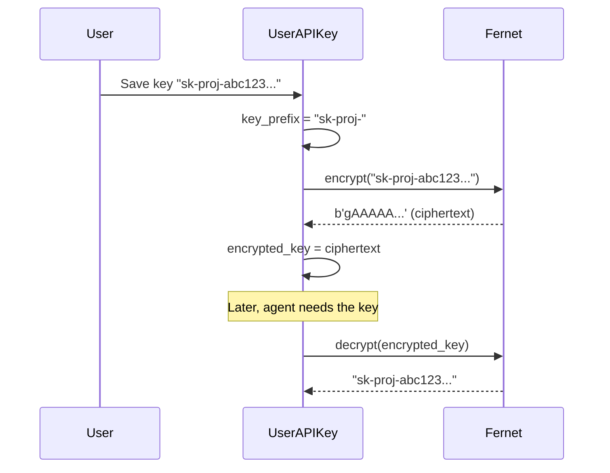

# UserAPIKey — Model Architecture

> Encrypted storage for user-provided API keys. "Bring your own key" for AI providers.

---

## The Key Insight

**Keys are encrypted at rest using Fernet symmetric encryption.** The database stores `encrypted_key` (binary) and `key_prefix` (first 8 chars for display). The plaintext key is *never* stored — it's decrypted on-the-fly when the agent needs it.

```
┌─────────────────────────────────────────────────────┐
│  UserAPIKey row                                      │
│                                                      │
│  encrypted_key = b'gAAAAA...' (Fernet ciphertext)    │
│  key_prefix    = "sk-proj-" (for UI display only)    │
│                                                      │
│  decrypt_api_key() → "sk-proj-abc123...xyz"           │
│  display_key    → "sk-proj-****" (masked for UI)      │
└─────────────────────────────────────────────────────┘
```

---

## Fields

| Field | Type | Default | Purpose |
|-------|------|---------|---------|
| `id` | `BigAutoField (PK)` | auto | Surrogate key. |
| `user` | `FK → CustomUser` | — | Key owner. `CASCADE`. `related_name="api_keys"` |
| `provider` | `CharField(50)` | — | AI provider. See choices below. |
| `provider_display_name` | `CharField(100)` | `null` | Custom name for "custom" provider. |
| `encrypted_key` | `BinaryField` | — | Fernet-encrypted API key. |
| `key_name` | `CharField(255)` | — | User-friendly label. |
| `key_prefix` | `CharField(20)` | `null` | First 8 chars of plaintext key (for UI identification). |
| `is_active` | `BooleanField` | `True` | Key is usable. |
| `is_default` | `BooleanField` | `False` | Default key for this provider. |
| `is_validated` | `BooleanField` | `False` | Key verified with provider API. |
| `last_validated_at` | `DateTimeField` | `null` | When last validated. |
| `validation_error` | `TextField` | `null` | Error from last validation attempt. |
| `usage_count` | `IntegerField` | `0` | Times used. |
| `last_used_at` | `DateTimeField` | `null` | When last used. |
| `total_tokens_used` | `BigIntegerField` | `0` | Cumulative tokens via this key. |
| `daily_limit` | `IntegerField` | `null` | Daily token cap. `null` = unlimited. |
| `monthly_limit` | `IntegerField` | `null` | Monthly token cap. `null` = unlimited. |
| `custom_config` | `JSONField` | `dict` | Provider-specific settings (base_url, API version, etc.). |

**Inherited from `TimestampedModel`:** `created_at`, `updated_at`

---

## Provider Choices (7)

| Value | Label |
|-------|-------|
| `openai` | OpenAI |
| `anthropic` | Anthropic (Claude) |
| `google` | Google AI |
| `cohere` | Cohere |
| `huggingface` | HuggingFace |
| `azure` | Azure OpenAI |
| `custom` | Custom Provider |

**`unique_together = [user, provider, key_name]`** — one key name per provider per user.

---

## Indexes (3)

| Name | Fields | Why |
|------|--------|-----|
| `apikey_user_provider_idx` | `user, provider` | Find user's keys for a provider. |
| `apikey_user_active_idx` | `user, is_active` | Active keys for a user. |
| `apikey_default_idx` | `is_default` | Fast default key lookup. |

**Default ordering:** `-is_default, -last_used_at`

---

## Properties

| Property | Returns | Logic |
|----------|---------|-------|
| `display_key` | `str` | `key_prefix + "****"` — masked for UI. E.g. `"sk-proj-****"`. |
| `provider_name` | `str` | Human-readable provider name. Custom providers use `provider_display_name`. |
| `has_limits` | `bool` | `daily_limit is not None or monthly_limit is not None`. |

---

## Instance Methods — Encryption

| Method | What It Does |
|--------|-------------|
| `get_encryption_key()` (static) | Returns `API_KEY_ENCRYPTION_KEY` from Django settings. Generates one if missing. |
| `encrypt_api_key(api_key)` | Encrypts key via Fernet. Stores prefix in `key_prefix`, ciphertext in `encrypted_key`. |
| `decrypt_api_key()` | Decrypts `encrypted_key` via Fernet. Returns plaintext string. |

### Encryption Flow



---

## Instance Methods — Validation & Usage

| Method | What It Does |
|--------|-------------|
| `validate_key()` | Calls provider API (e.g., `client.models.list()`). Sets `is_validated`, `last_validated_at`, `validation_error`. Returns `{valid, error}`. |
| `increment_usage(tokens_used)` | `usage_count += 1`, `total_tokens_used += tokens_used`, `last_used_at = now()`. |
| `rotate_key(new_api_key)` | Re-encrypt new key. Resets `is_validated=False`. |
| `deactivate()` | `is_active = False`. Soft delete. |
| `check_limits(tokens_to_use)` | Queries `TokenUsage` for daily/monthly consumption. Returns `{allowed, reason}`. |

---

## Class Methods

| Method | Returns | Purpose |
|--------|---------|---------|
| `get_default_key(user, provider)` | `UserAPIKey or None` | Default active key for provider. |
| `get_any_active_key(user, provider)` | `UserAPIKey or None` | Fallback: default → most recently used → any active. |
| `get_providers_for_user(user)` | `list[str]` | Distinct provider names with active keys. |
| `get_usage_summary(user)` | `dict` | Aggregated: total_keys, active_keys, total_tokens, by_provider breakdown. |

### Key Selection Priority

```
get_any_active_key(user, "openai")
  → ORDER BY -is_default, -last_used_at
  → 1. Default key (if active)
  → 2. Most recently used key
  → 3. Any active key
```

---

## Design Decisions

| Decision | Why |
|----------|-----|
| **Fernet encryption at rest** | API keys are secrets. DB compromise shouldn't expose plaintext. Fernet provides authenticated encryption. |
| **`key_prefix` stored in plaintext** | UI needs to show which key is which. First 8 chars are not secret (visible in provider dashboards). |
| **`unique_together = [user, provider, key_name]`** | Prevents duplicate key names per provider. User can have multiple OpenAI keys with different names. |
| **`validate_key()` calls provider API** | Best way to verify a key works. Catches revoked/expired keys. |
| **`rotate_key()` resets validation** | New key is unvalidated by default. Forces re-verification. |
| **`check_limits()` queries TokenUsage** | Limits are enforced at request time, not stored on the key. Keeps key model simple. |
| **`custom_config` JSONField** | Azure needs `base_url` + `api_version`. Google needs `project_id`. One field handles all. |