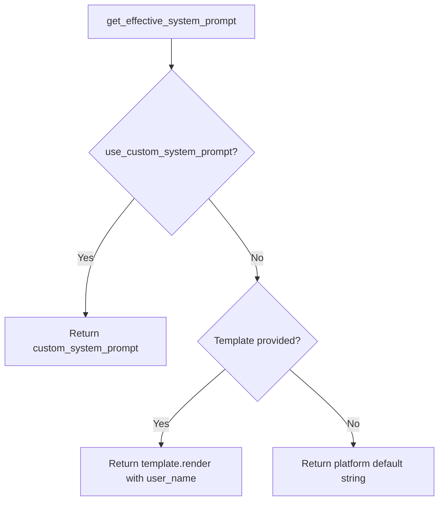
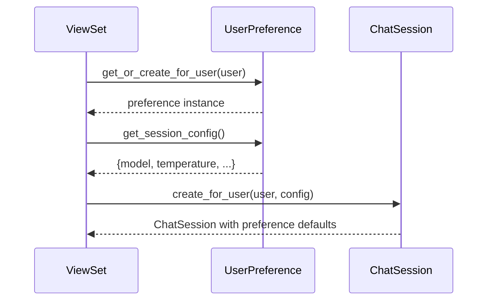

# UserPreference — Model Architecture

> Per-user AI chatbot defaults. One row per user. Feeds into ChatSession creation and LangGraph config.

---

## The Key Insight

**UserPreference is the single source of defaults for new sessions.** When `ChatSession.create_for_user()` runs, it reads `user.ai_preferences` to populate model, temperature, and summarization settings. The `PREFERENCE_DEFAULTS` dict provides platform-level fallbacks — no DB query needed.

```
┌────────────────────────────────────────────────────────────┐
│  Preference Resolution Chain                                │
│                                                             │
│  1. UserPreference (DB) ── user's explicit choices          │
│  2. PREFERENCE_DEFAULTS (code) ── platform defaults         │
│  3. get_default_config() ── no-user fallback (anonymous)   │
└────────────────────────────────────────────────────────────┘
```

---

## Fields

| Field | Type | Default | Purpose |
|-------|------|---------|---------|
| `id` | `BigAutoField (PK)` | auto | Surrogate key. |
| `user` | `OneToOneField → CustomUser` | — | One preference per user. `CASCADE`. `related_name="ai_preferences"` |
| `default_model` | `CharField(100)` | `"gpt-5-mini"` | AI model for new conversations. See choices below. |
| `default_temperature` | `FloatField` | `0.7` | Creativity level (0.0–2.0). |
| `default_max_tokens` | `IntegerField` | `2000` | Max response length. |
| `enable_auto_summarization` | `BooleanField` | `True` | Auto-summarize long conversations. |
| `summarization_trigger_tokens` | `IntegerField` | `384` | Token count to trigger summarization. |
| `max_summary_tokens` | `IntegerField` | `128` | Max tokens in summary. |
| `summarization_style` | `CharField(20)` | `"concise"` | Summary format. See choices below. |
| `custom_system_prompt` | `TextField` | `null` | User's custom system prompt. |
| `use_custom_system_prompt` | `BooleanField` | `False` | Use custom prompt instead of default. |
| `response_language` | `CharField(10)` | `"en"` | Preferred language code. |
| `enable_streaming` | `BooleanField` | `True` | Word-by-word streaming. |
| `enable_code_execution` | `BooleanField` | `False` | Allow AI to run code (advanced). |
| `daily_message_limit` | `IntegerField` | `100` | Max messages/day. `0` = unlimited. |
| `daily_token_limit` | `IntegerField` | `50000` | Max tokens/day. `0` = unlimited. |
| `theme` | `CharField(20)` | `"auto"` | UI theme. See choices below. |
| `show_token_count` | `BooleanField` | `False` | Show token count in UI. |
| `enable_notifications` | `BooleanField` | `True` | Browser notifications. |
| `save_conversation_history` | `BooleanField` | `True` | Persist conversations. |
| `allow_data_training` | `BooleanField` | `False` | Consent for model training. |
| `additional_settings` | `JSONField` | `dict` | Extensible user settings. |

**Inherited from `TimestampedModel`:** `created_at`, `updated_at`

---

## Choice Fields

### Model Choices (5)

| Value | Label |
|-------|-------|
| `gpt-5-mini` | GPT-5 Mini (Recommended) |
| `gpt-5-nano` | GPT-5 Nano (Smaller/Faster) |
| `gpt-4.1-mini` | GPT-4.1 Mini (Faster/Cheaper) |
| `gpt-4o-mini` | GPT-4o Mini (Faster/Cheaper) |
| `o4-mini` | GPT-o4 Mini (Reasoning) |

### Summarization Style (3)

| Value | Label |
|-------|-------|
| `concise` | Concise (Brief summaries) |
| `detailed` | Detailed (More context) |
| `bullet` | Bullet Points |

### Theme (3)

| Value | Label |
|-------|-------|
| `light` | Light Theme |
| `dark` | Dark Theme |
| `auto` | Auto (System) |

---

## `PREFERENCE_DEFAULTS` — Platform-Level Constants

Defined at module level. Used by `reset_to_defaults()` and `get_default_config()`:

```python
PREFERENCE_DEFAULTS = {
    "default_model": "gpt-5-mini",
    "default_temperature": 0.7,
    "default_max_tokens": 2000,
    "enable_auto_summarization": True,
    "summarization_trigger_tokens": 384,
    "max_summary_tokens": 128,
    "summarization_style": "concise",
    "response_language": "en",
    "enable_streaming": True,
    "enable_code_execution": False,
    "daily_message_limit": 100,
    "daily_token_limit": 50000,
    "theme": "auto",
    "show_token_count": False,
    "enable_notifications": True,
    "save_conversation_history": True,
    "allow_data_training": False,
}
```

---

## Properties

| Property | Returns | Logic |
|----------|---------|-------|
| `has_usage_limits` | `bool` | `daily_message_limit > 0 or daily_token_limit > 0` |
| `is_dark_mode` | `bool` | `theme == "dark"` |
| `is_light_mode` | `bool` | `theme == "light"` |

---

## Instance Methods

### Session Configuration

| Method | Returns | What It Does |
|--------|---------|-------------|
| `get_session_config()` | `dict` | Config dict for `ChatSession` creation: model, temperature, max_tokens, summarization, system_prompt, language, streaming. |
| `get_effective_system_prompt(template=None)` | `str` | Resolves prompt priority: (1) user custom, (2) provided template, (3) platform default. |

### System Prompt Priority



### Lifecycle

| Method | Returns | What It Does |
|--------|---------|-------------|
| `reset_to_defaults()` | — | Resets all fields to `PREFERENCE_DEFAULTS`. Clears custom prompt. Keeps `user` and `additional_settings`. |
| `update_from_dict(data)` | `list[str]` | Bulk-update from validated dict. Only updates fields that exist on model. Ignores `id` and `user`. Returns list of updated field names. |
| `to_display_dict()` | `dict` | Serializable dict for API. Includes computed `has_usage_limits`, `has_custom_prompt`. |

---

## Class Methods

| Method | Returns | Purpose |
|--------|---------|---------|
| `get_or_create_for_user(user)` | `UserPreference` | Idempotent. Returns existing or creates with defaults. |
| `get_default_config()` | `dict` | Platform defaults from `PREFERENCE_DEFAULTS`. No DB query. Used for anonymous users. |

### Preference → Session Flow



---

## Design Decisions

| Decision | Why |
|----------|-----|
| **OneToOne to user** | One preference row per user. No ambiguity about which preference applies. |
| **`PREFERENCE_DEFAULTS` as module constant** | No DB query for defaults. Anonymous users, tests, and `reset_to_defaults()` all use the same source. |
| **`get_or_create_for_user()`** | Safe to call from anywhere. No `DoesNotExist` risk. |
| **`update_from_dict()` ignores unknown keys** | Serializer validated_data may contain non-model fields. Silently ignoring is safer than crashing. |
| **`get_effective_system_prompt()` 3-tier priority** | User choice > template > platform default. Clear precedence, no surprises. |
| **`daily_message_limit = 0` means unlimited** | `0` is a natural sentinel. Avoids nullable int field. |
| **No indexes** | Always accessed via `user.ai_preferences` (OneToOne). The FK is implicitly indexed. |