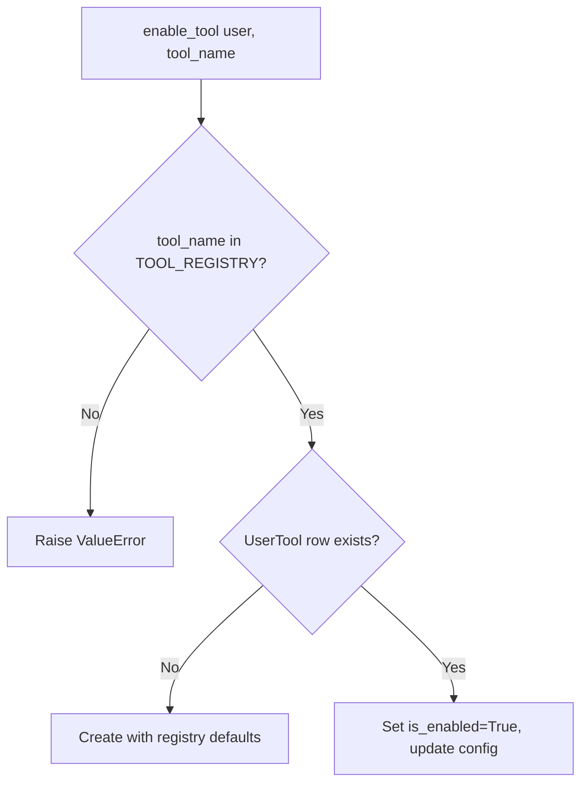

# UserTool — Model Architecture

> Per-user tool enable/disable with config overrides. Tool definitions live in code, not the DB.

---

## The Key Insight

**Available tools are defined in `TOOL_REGISTRY` (code), not a database table.** `UserTool` only stores which tools a user has enabled and their per-user config overrides. This is the "code-first configuration" pattern — add a tool by editing `TOOL_REGISTRY`, then seed user rows via management command.

```
┌──────────────────────────────────────────────────────────────┐
│  TOOL_REGISTRY (code)                                         │
│                                                               │
│  "web_search":  {display_name, description, category, icon,  │
│                  default_config: {max_results: 5}}            │
│  "code_executor": {...}                                       │
│  "calculator": {...}                                           │
│  "document_retriever": {...}                                  │
│                                                               │
│  ── seed_all_tools() ──► ┌──────────────────────────────┐     │
│                          │ UserTool rows (DB)            │     │
│                          │ user + tool_name + is_enabled │     │
│                          │ configuration (user overrides)│     │
│                          └──────────────────────────────┘     │
└──────────────────────────────────────────────────────────────┘
```

---

## TOOL_REGISTRY — Code-First Definitions

| Key | Display Name | Category | Default Config |
|-----|-------------|----------|---------------|
| `web_search` | Web Search | search | `{max_results: 5}` |
| `code_executor` | Code Executor | code | `{timeout_seconds: 30}` |
| `calculator` | Calculator | utility | `{}` |
| `document_retriever` | Document Retriever | search | `{top_k: 5}` |

---

## Fields

| Field | Type | Default | Purpose |
|-------|------|---------|---------|
| `id` | `BigAutoField (PK)` | auto | Surrogate key. |
| `user` | `FK → CustomUser` | — | Tool owner. `CASCADE`. `related_name="enabled_tools"` |
| `tool_name` | `CharField(100)` | — | Internal name matching `TOOL_REGISTRY` key. |
| `tool_display_name` | `CharField(255)` | — | Human-readable name. |
| `is_enabled` | `BooleanField` | `True` | User has this tool turned on. |
| `configuration` | `JSONField` | `dict` | User overrides for tool settings. |
| `description` | `TextField` | `null` | What this tool does. |
| `category` | `CharField(50)` | `"general"` | Tool category. See choices below. |
| `icon` | `CharField(10)` | `null` | Emoji for UI. |
| `usage_count` | `IntegerField` | `0` | Times used. |
| `last_used_at` | `DateTimeField` | `null` | When last used. |
| `rate_limit` | `IntegerField` | `null` | Max uses per period. `null` = unlimited. |
| `rate_limit_period` | `CharField(20)` | `"hour"` | Rate limit window. See choices below. |
| `requires_approval` | `BooleanField` | `False` | Admin must approve usage. |
| `is_approved` | `BooleanField` | `True` | Admin has approved. |
| `approved_by` | `FK → CustomUser` | `null` | Admin who approved. `SET_NULL`. `related_name="approved_tools"` |
| `approved_at` | `DateTimeField` | `null` | When approved. |

**Inherited from `TimestampedModel`:** `created_at`, `updated_at`

**`unique_together = [user, tool_name]`** — one config per tool per user.

---

## Category Choices (6)

| Value | Label |
|-------|-------|
| `search` | Search & Retrieval |
| `code` | Code Execution |
| `data` | Data Processing |
| `integration` | External Integration |
| `utility` | Utility |
| `custom` | Custom |

---

## Rate Limit Period Choices (3)

| Value | Label |
|-------|-------|
| `minute` | Per Minute |
| `hour` | Per Hour |
| `day` | Per Day |

---

## Indexes (3)

| Name | Fields | Why |
|------|--------|-----|
| `usertool_user_enabled_idx` | `user, is_enabled` | User's enabled tools. |
| `usertool_name_idx` | `tool_name` | Find all users with a tool. |
| `usertool_category_idx` | `category` | Filter by category. |

**Default ordering:** `tool_display_name`

---

## Instance Methods — Lifecycle

| Method | What It Does | Fields Updated |
|--------|-------------|---------------|
| `activate()` | Enable tool | `is_enabled=True` |
| `deactivate()` | Disable tool | `is_enabled=False` |
| `increment_usage()` | Track usage | `usage_count += 1`, `last_used_at=now()` |
| `reset_usage()` | Reset counter | `usage_count=0` |
| `approve(approved_by_user)` | Admin approval | `is_approved=True`, `approved_by`, `approved_at=now()` |

---

## Instance Methods — Configuration

| Method | Returns | What It Does |
|--------|---------|-------------|
| `get_effective_config()` | `dict` | Merge `TOOL_REGISTRY` defaults + user `configuration` overrides. User wins on conflict. |
| `get_display_info()` | `dict` | Display-friendly dict for serializers: name, description, category, icon, enabled, usage. |
| `check_rate_limit()` | `dict` | Queries `TokenUsage` for recent usage. Returns `{allowed, remaining, reset_at, current_usage, limit}`. |

### Config Merge Example

```python
# TOOL_REGISTRY default
{"max_results": 5}

# User override (configuration field)
{"max_results": 10, "region": "us-east"}

# get_effective_config() result
{"max_results": 10, "region": "us-east"}  # user wins on max_results
```

---

## Class Methods

| Method | Returns | Purpose |
|--------|---------|---------|
| `get_user_tools(user, enabled_only=True)` | QuerySet | User's tools. Optionally filter enabled + approved. |
| `get_enabled_for_user(user)` | `list[UserTool]` | Ready-to-use tools for LangGraph agent. |
| `get_tool_config(user, tool_name)` | `dict` | Merged config. Falls back to registry defaults if no UserTool row. |
| `enable_tool(user, tool_name, configuration=None)` | `UserTool` | Create or enable from registry. Raises `ValueError` if tool not in registry. |
| `disable_tool(user, tool_name)` | — | Set `is_enabled=False`. |
| `bulk_enable(user, tool_names)` | `list[UserTool]` | Enable multiple tools at once. |
| `seed_all_tools(user)` | `list[(UserTool, created)]` | Create rows for every registry tool. All disabled by default. |

### `enable_tool()` — Registry Validation



---

## Design Decisions

| Decision | Why |
|----------|-----|
| **`TOOL_REGISTRY` in code, not DB** | Tool definitions change with code deploys. A DB table would drift out of sync. Code-first = single source of truth. |
| **`unique_together = [user, tool_name]`** | One config per tool per user. No duplicates. |
| **`get_effective_config()` merges defaults + overrides** | Users shouldn't have to specify every setting. Override only what you need. |
| **`seed_all_tools()` creates disabled** | Opt-in model. User explicitly enables tools they want. |
| **`check_rate_limit()` queries TokenUsage** | Rate limits are enforced at request time. Keeps UserTool model focused on config. |
| **`requires_approval` + `is_approved`** | Dangerous tools (code executor) can require admin sign-off. Two-flag system: feature flag + approval flag. |
| **No `AvailableTool` model** | Deliberate removal. For an intern project, tool definitions in code teach the "code-first config" pattern better than a DB table. |