# Web Architecture Fundamentals: Request-Response → CSR → MVC → Django MVT

> **For Interns** — A crisp, visual progression from *how the web works* to *how Django thinks*. We build up layer by layer: generic first, framework last.

---

## Table of Contents

1. [The Universal Request-Response Cycle](#1-the-universal-request-response-cycle)
2. [CSR Architecture — Controller, Service, Repository](#2-csr-architecture--controller-service-repository)
3. [MVC Architecture — The Universal Pattern](#3-mvc-architecture--the-universal-pattern)
4. [Django's MVT — Why Django Broke MVC](#4-djangos-mvt--why-django-broke-mvc)
5. [MVT vs CSR — Overlap & Difference](#5-mvt-vs-csr--overlap--difference)
6. [MVT in Our Project — The Real Code](#6-mvt-in-our-project--the-real-code)
7. [Key Takeaways](#7-key-takeaways)

---

## 1. The Universal Request-Response Cycle

Every web interaction — every click, every API call, every page load — follows the **same fundamental cycle**. It doesn't matter if you're using Django, Express, Spring Boot, or a raw TCP socket. This is the foundation.

```
┌──────────┐                          ┌──────────────────────┐
│          │      1. REQUEST          │                      │
│  CLIENT  │ ───────────────────────► │      SERVER          │
│          │   (URL + Method +        │                      │
│          │    Headers + Body)       │                      │
│          │                          │   2. PROCESS         │
│          │                          │   (Route → Handle    │
│          │                          │    → Query → Format) │
│          │      3. RESPONSE         │                      │
│          │ ◄─────────────────────── │                      │
│          │   (Status + Headers +    │                      │
│          │    Body)                 │                      │
└──────────┘                          └──────────────────────┘
```

### The 4 Parts of Every Request

| Part | What It Is | Example |
|------|-----------|---------|
| **URL** | *Where* the resource lives | `/api/v1/chat-sessions/` |
| **Method** | *What* you want to do | `GET`, `POST`, `PUT`, `DELETE` |
| **Headers** | *Metadata* about the request | `Authorization: Bearer eyJ...`, `Content-Type: application/json` |
| **Body** | *Data* you're sending | `{"title": "Python Help"}` |

### The 3 Parts of Every Response

| Part | What It Is | Example |
|------|-----------|---------|
| **Status Code** | *What happened* | `200 OK`, `201 Created`, `404 Not Found` |
| **Headers** | *Metadata* about the response | `Content-Type: application/json`, `Set-Cookie: ...` |
| **Body** | *The actual data* | `{"id": "550e...", "title": "Python Help"}` |

### The Full Cycle — Step by Step

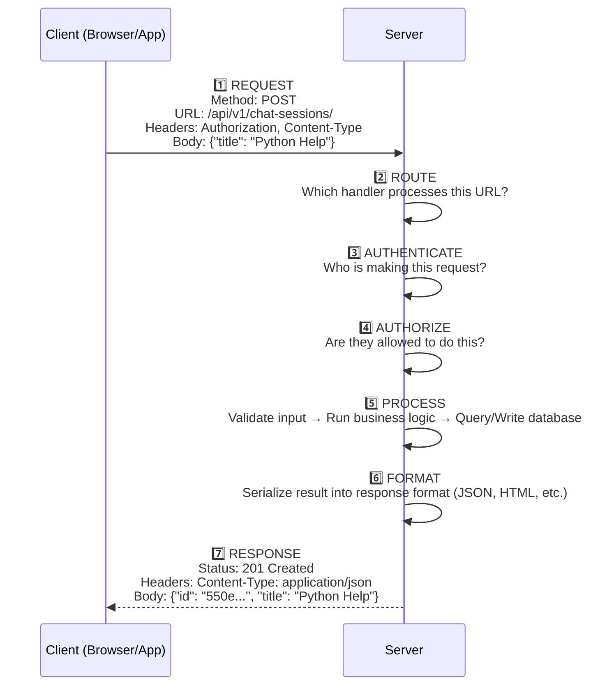

> **This is universal.** Whether you're building with Django, Flask, Express, FastAPI, Spring Boot, or Rails — these 7 steps happen every single time. The only difference is *what code* handles each step.

---

## 2. CSR Architecture — Controller, Service, Repository

The **Controller-Service-Repository (CSR)** pattern is a layered software architecture that organizes backend code by breaking it into distinct, single-purpose layers. It restricts tight coupling by separating the entry point (Controller), the core business logic (Service), and data access (Repository), making applications highly scalable and testable.

### The Standard Data Flow

```
Client Request → Controller → Service → Repository → Database
                                                    ↓
Client Response ← Controller ← Service ← Repository ← Database
```

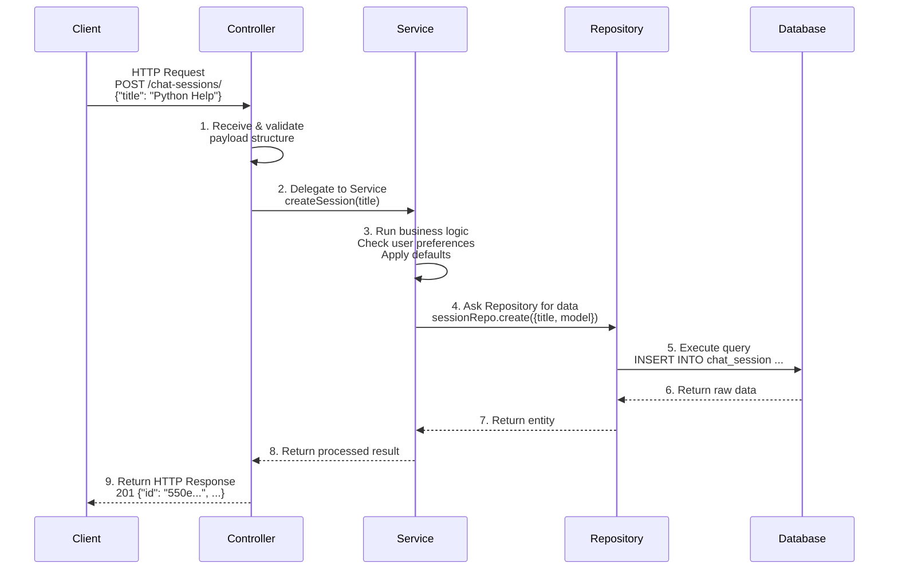

### The 3 Layers — What Each Does

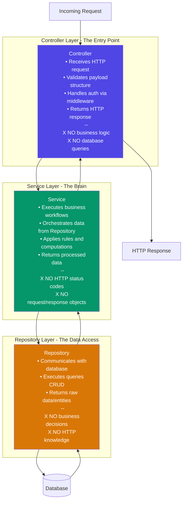

### Layer 1: Controller (The Entry Point)

The controller acts as the **manager of incoming client requests**. It deals exclusively with HTTP concerns.

**Responsibilities:**
- Receives the HTTP request (JSON body, query parameters, headers)
- Validates payload structure (is the required field present?)
- Handles authentication (often via middleware)
- Returns a formatted HTTP response (status codes, headers, body)

**What it avoids:**
- Contains **no business logic** — it doesn't calculate, transform, or decide
- Contains **no database queries** — it delegates to the Service

```python
# Controller — HTTP concerns only
class ChatSessionController:
    def create(self, request):
        title = request.data.get("title")

        # Validate payload structure
        if not title:
            return Response({"error": "Title is required"}, status=400)

        # Delegate to Service
        session = ChatSessionService.create_session(request.user, title)

        # Return HTTP response
        return Response(session, status=201)
```

### Layer 2: Service (The Brain)

The service layer contains the **core business logic and computational rules**. It's the most important layer — it's what makes your app *do things*.

**Responsibilities:**
- Executes complex workflows (e.g., verify inventory before an order, process payments)
- Orchestrates data from the Repository
- Applies business rules and computations
- Returns processed data to the Controller

**What it avoids:**
- Doesn't know about HTTP status codes, request URLs, or response objects
- Doesn't query the database directly — it uses the Repository
- **Reusable across platforms** (web, mobile, CLI) because it has no HTTP dependency

```python
# Service — Business logic only, no HTTP
class ChatSessionService:
    @staticmethod
    def create_session(user, title):
        # Business rule: apply user preferences as defaults
        prefs = UserPreferenceRepo.find_by_user(user.id)
        model_name = prefs.default_code_model if "code" in title else prefs.default_model

        # Business rule: limit active sessions per user
        active_count = ChatSessionRepo.count_active(user.id)
        if active_count >= 50:
            raise BusinessError("Maximum active sessions reached")

        # Delegate to Repository for data persistence
        session = ChatSessionRepo.create(
            user_id=user.id,
            title=title,
            model_name=model_name,
            temperature=prefs.default_temperature,
        )
        return session
```

### Layer 3: Repository (The Data Access)

Also known as the **DAO (Data Access Object)**, this is the bridge between the application and persistent storage.

**Responsibilities:**
- Communicates directly with the database or external APIs
- Executes the actual queries (Insert, Fetch, Update, Delete)
- Returns raw data/entities to the Service

**What it avoids:**
- Doesn't make business decisions — it simply provides raw data
- Doesn't know about HTTP or the client
- Doesn't transform data — that's the Service's job

```python
# Repository — Data access only, no business logic
class ChatSessionRepository:
    @staticmethod
    def create(data):
        result = db.execute(
            "INSERT INTO chat_sessions (user_id, title, model_name, temperature) "
            "VALUES (%s, %s, %s, %s) RETURNING *",
            [data["user_id"], data["title"], data["model_name"], data["temperature"]]
        )
        return result.fetchone()

    @staticmethod
    def find_active_by_user(user_id):
        result = db.execute(
            "SELECT * FROM chat_sessions WHERE user_id = %s AND is_active = true "
            "ORDER BY updated_at DESC",
            [user_id]
        )
        return result.fetchall()

    @staticmethod
    def count_active(user_id):
        result = db.execute(
            "SELECT COUNT(*) FROM chat_sessions WHERE user_id = %s AND is_active = true",
            [user_id]
        )
        return result.fetchone()[0]
```

### Why CSR Beats Spaghetti Code

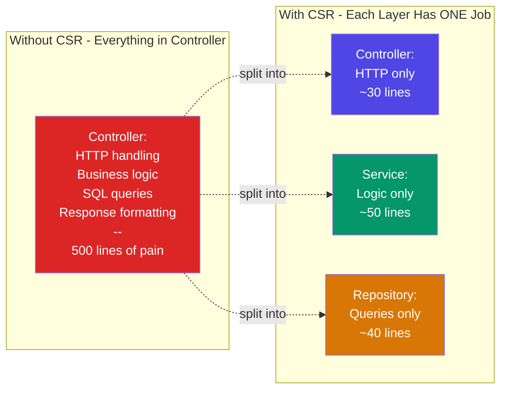

| Anti-Pattern | Problem | CSR Fix |
|-------------|---------|---------|
| SQL queries in Controller | Can't test without HTTP server, can't reuse | Move to Repository |
| Business rules in Controller | Duplicated across endpoints, tangled with HTTP | Move to Service |
| HTTP status codes in Service | Service can't be reused for CLI, mobile, workers | Service returns data/errors, Controller maps to HTTP |
| Business logic in Repository | Rules duplicated if multiple services use same query | Repository returns raw data, Service applies rules |

### CSR Across Frameworks

The CSR pattern is **framework-agnostic**. Here's how the same 3 layers map across different ecosystems:

| Layer | Node.js / Express | Java / Spring Boot | Python / FastAPI | C# / .NET |
|-------|-------------------|--------------------|------------------|-----------|
| **Controller** | Route handler | `@RestController` | `@router.post()` | `[ApiController]` |
| **Service** | Service class | `@Service` class | Service function | `IService` interface |
| **Repository** | Model / DAO | `@Repository` + JPA | SQLAlchemy / Tortoise | `IRepository` + EF |

> **Key insight:** The names change, the pattern doesn't. Controller receives, Service thinks, Repository stores.

### The Dependency Rule

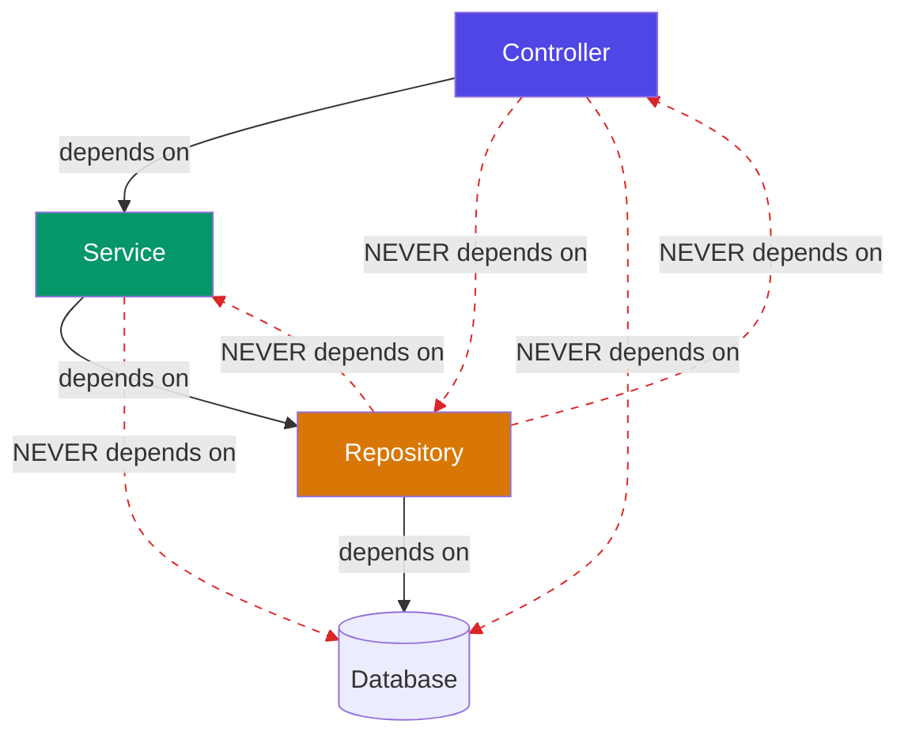

**Dependencies flow downward only.** The Controller depends on the Service, the Service depends on the Repository. Never the reverse. This is what makes the system testable — you can mock the Repository to test the Service, or mock the Service to test the Controller.

---

## 3. MVC Architecture — The Universal Pattern

Almost every web framework organizes code using **Model-View-Controller (MVC)**. It's the industry standard pattern for separating concerns.

### The MVC Triangle

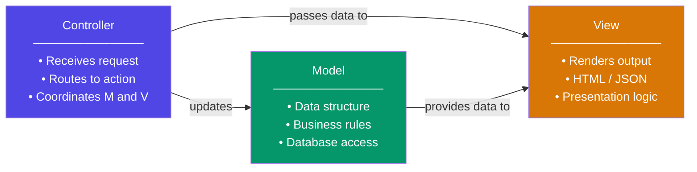

### MVC Flow — Step by Step

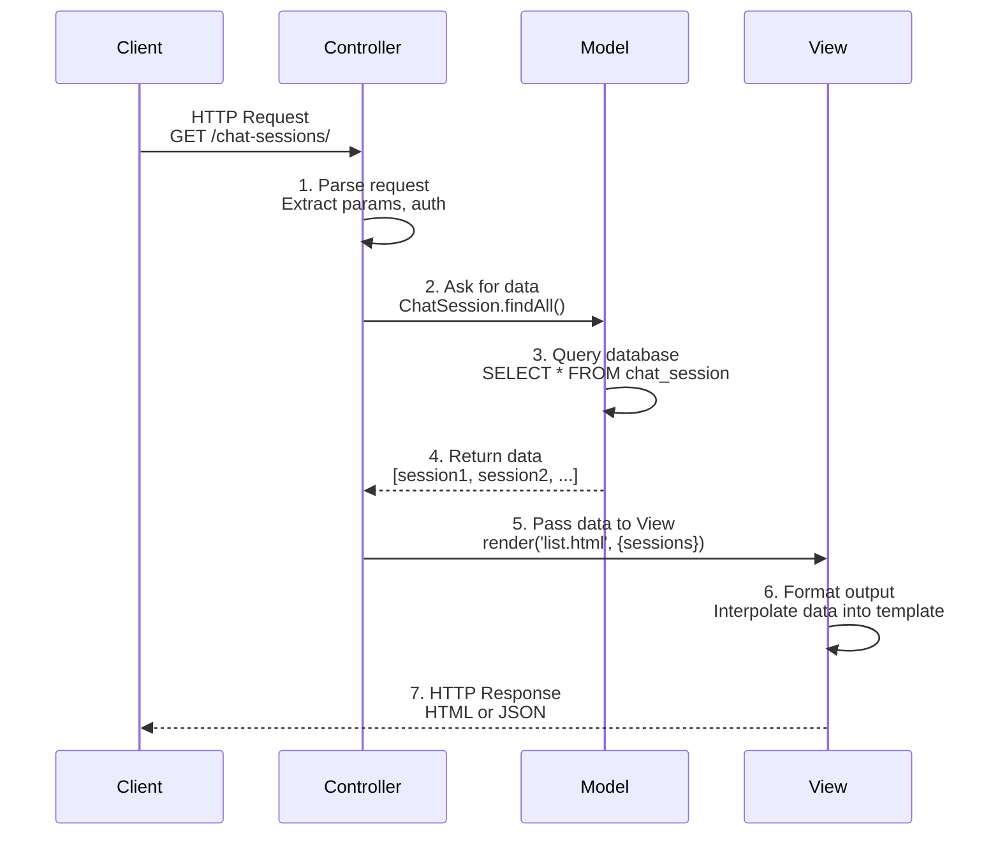

### What Each Letter Does

| Component | Responsibility | What It Does NOT Do |
|-----------|--------------|-------------------|
| **Model** | Data + business rules + persistence | Doesn't handle HTTP, doesn't render UI |
| **View** | Presentation — renders output | Doesn't query database, doesn't handle requests |
| **Controller** | Request handling — coordinates M and V | Doesn't store data, doesn't render |

### MVC in Different Frameworks

| Framework | Model | View | Controller |
|-----------|-------|------|------------|
| **Ruby on Rails** | ActiveRecord | ERB Templates | ApplicationController |
| **Spring Boot** | JPA Entities | Thymeleaf/JSP | @RestController |
| **Laravel** | Eloquent Models | Blade Templates | Controller classes |
| **Express.js** | Mongoose/Sequelize | EJS/Pug | Route handlers |
| **ASP.NET MVC** | Entity Framework | Razor Views | Controller classes |

> **Notice:** Every framework calls them slightly different names, but the pattern is the same. Model = data, View = output, Controller = coordinator.

### The Problem MVC Solves

Without MVC, you get **spaghetti code** — everything in one file:

```python
# ❌ NO MVC — Everything mixed together
def handle_request(request):
    # HTTP handling
    if request.method != 'POST':
        return Response(status=405)

    # Business logic
    if not request.data.get('title'):
        return Response({'error': 'Title required'}, status=400)

    # Database access
    db.execute('INSERT INTO sessions (title) VALUES (?)', [request.data['title']])

    # Presentation
    html = f"<div>Created session: {request.data['title']}</div>"
    return Response(html)
```

With MVC, each concern has its own home:

```python
# ✅ MVC — Separated concerns

# Model (data + rules)
class ChatSession:
    def save(self): ...

# View (presentation)
def render_session_list(sessions): ...

# Controller (coordination)
class ChatSessionController:
    def create(self, request):
        session = ChatSession(title=request.data['title'])
        session.save()
        return render_session_list([session])
```

---

## 4. Django's MVT — Why Django Broke MVC

Here's the twist: **Django doesn't use MVC.** It uses **MVT (Model-View-Template)**, and the mapping confuses everyone at first.

### MVC → MVT Translation

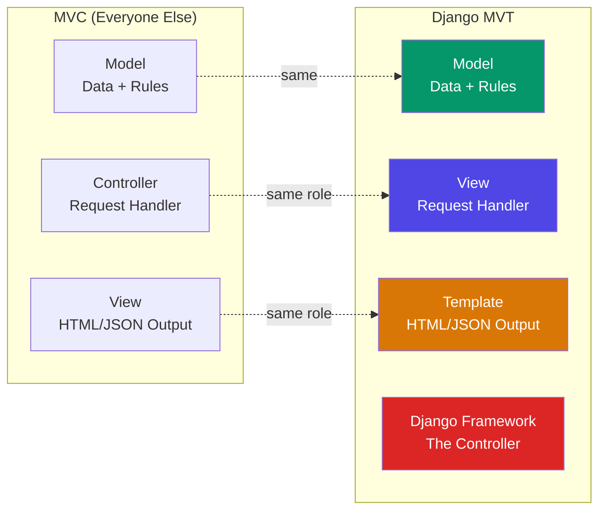

### The Mapping Table

| MVC Term | Django Equivalent | What It Does | Why the Name Change |
|----------|-------------------|--------------|---------------------|
| **Model** | **Model** | Same — data, rules, DB access | No change. Same concept. |
| **Controller** | **View** | Handles requests, coordinates | Django calls request handlers "views" |
| **View** | **Template** | Renders output (HTML/JSON) | Django calls output templates "templates" |
| *(none)* | **Django Framework** | URL routing, middleware, dispatch | Django itself IS the controller |

### Why Django Calls It "View"

In MVC, the Controller *controls* the flow. In Django, the View *views* the request and decides what to do. It's a philosophical difference:

- **MVC Controller:** "I control everything. I tell the Model what to do and the View what to show."
- **Django View:** "I view the request. I see what's needed, fetch data, and pick a template."

The result is the same. The naming is different.

### The Missing Controller — Django IS the Controller

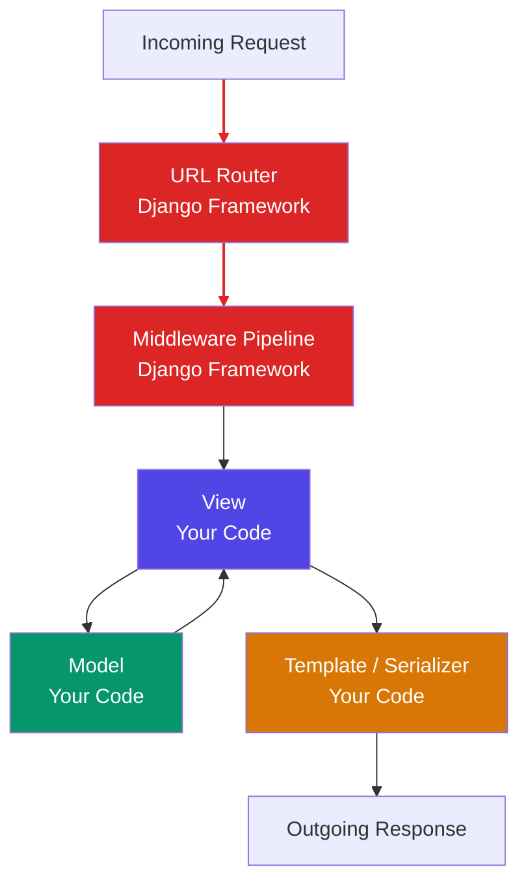

> **Red = Django Framework (the Controller).** URL routing, middleware processing, request dispatching — Django handles all of this automatically. You never write a "Controller" class. You write Models, Views, and Templates.

### MVT Flow — Step by Step

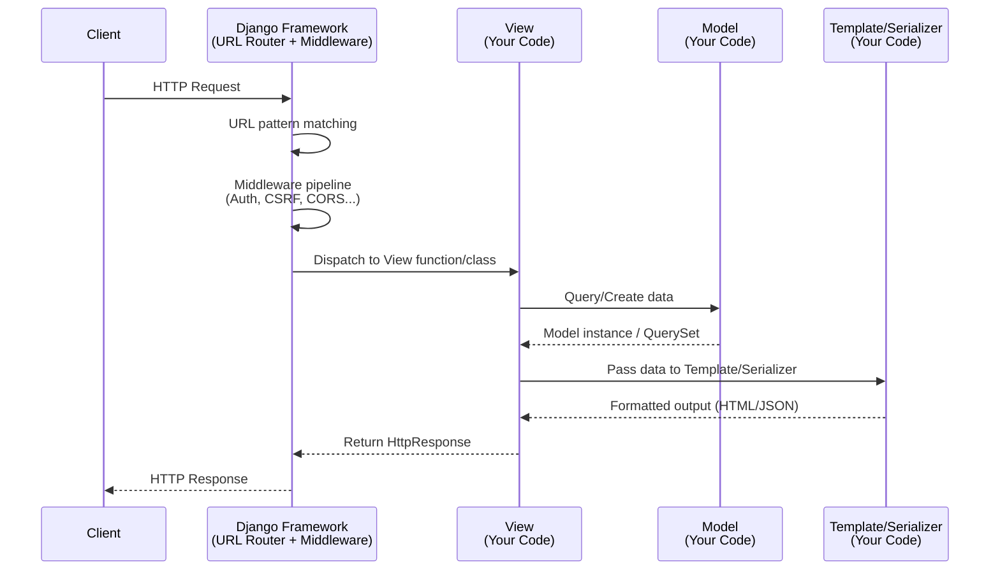

### MVT in a REST API — Serializer Replaces Template

In a traditional Django app, the Template renders HTML. In a **REST API** (like our project), there are no HTML templates. The **Serializer** takes the Template's role:

| Traditional Django (HTML) | Our DRF Project (JSON) |
|--------------------------|----------------------|
| `template.html` renders HTML | `Serializer` renders JSON |
| `{{ variable }}` in template | `field = CharField()` in serializer |
| Template context dict | Serializer `context` dict |
| `` | `Serializer(queryset, many=True)` |
| `render(request, 'template.html', context)` | `Response(serializer.data)` |

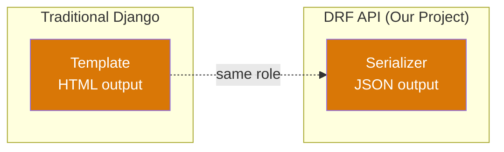

## 5. MVT vs CSR — Overlap & Difference

This is the #1 source of confusion for beginners. **MVT and CSR are NOT substitutes for each other.** They solve different problems at different levels. But they overlap in one critical place — and that's where people get tripped up.

### They Solve Different Problems

| | CSR (Controller-Service-Repository) | MVT (Model-View-Template) |
|---|---|---|
| **What it is** | A **layered architecture pattern** — how to organize code by responsibility | A **framework architecture** — how Django specifically routes and processes requests |
| **Scope** | Backend logic only | Full request-response pipeline (routing + logic + output) |
| **Origin** | Pattern from enterprise Java/.NET, adopted by Node.js, Python, Go | Django's specific interpretation of MVC |
| **Framework-agnostic?** | Yes — works in Express, FastAPI, Spring, Django, anywhere | No — this is how Django thinks |

### The Overlap: Where They Touch

Both patterns care about **separating concerns**. The overlap is in the middle layers:

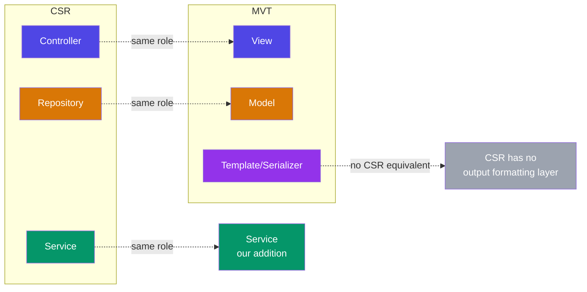

### The Mapping — Side by Side

| CSR Layer | MVT Equivalent | Same Role? | Key Difference |
|-----------|---------------|------------|----------------|
| **Controller** | **View** (ViewSet) | Yes — both receive requests, validate input, return responses | Django's View also handles URL routing (via framework). CSR Controller is explicit. |
| **Service** | **Not in standard MVT** | N/A | Standard Django puts business logic in the View. Our project adds a Service layer — which IS the CSR Service. |
| **Repository** | **Model** | Partially — both access data | CSR Repository is a **separate class** for queries. Django Model is both data schema AND query access (via ORM). |
| *(none)* | **Template/Serializer** | N/A | CSR has no output formatting layer — the Controller returns raw data. MVT explicitly separates output formatting. |

### The Critical Differences

**1. Model ≠ Repository**

This is the biggest confusion point. In CSR, the Repository is a **dedicated data-access class**. In Django, the Model does double duty:

```python
# CSR: Repository is SEPARATE from the data structure
class ChatSessionRepository:          # Data access only
    @staticmethod
    def find_active(user_id): ...

class ChatSession:                    # Data structure only (no queries)
    def __init__(self, id, title): ...

# Django MVT: Model IS the data structure AND the query interface
class ChatSession(models.Model):      # Data structure + queries in one class
    title = models.CharField(...)
    
    @staticmethod
    def find_active(user_id):         # Queries live on the Model
        return ChatSession.objects.filter(user_id=user_id, is_active=True)
```

| | CSR Repository | Django Model |
|---|---|---|
| What it holds | Queries only | Data schema + queries + validation |
| Can you have one without the other? | Yes — Repository is independent | No — Model is the ORM |
| Testability | Mock the Repository | Mock the Model's `.objects` manager |

**2. CSR has no Template/Serializer**

CSR stops at the Controller returning data. It doesn't care about **output formatting**. MVT explicitly separates this:

```python
# CSR: Controller returns raw data directly
class ChatSessionController:
    def list(self, request):
        sessions = ChatSessionService.get_sessions(request.user)
        return Response(sessions)  # Raw data, no formatting layer

# MVT: View passes data through Serializer (Template) for formatting
class ChatSessionViewSet(viewsets.ModelViewSet):
    def list(self, request):
        queryset = self.get_queryset()
        serializer = ChatSessionListSerializer(queryset, many=True)
        return Response(serializer.data)  # Formatted output
```

**3. Django Framework = The Missing CSR Router**

CSR assumes you wire routes manually. Django's framework IS the routing layer:

```python
# CSR: You write routing explicitly (Express example)
app.post("/chat-sessions", ChatSessionController.create)
app.get("/chat-sessions", ChatSessionController.list)

# Django MVT: Router auto-generates routes from ViewSet
router = DefaultRouter()
router.register("chat-sessions", ChatSessionViewSet)
# Automatically creates: list, create, retrieve, update, destroy
```

### How They Combine in Our Project

Our project uses **both patterns together**. MVT is the framework skeleton. CSR is the code organization within it:

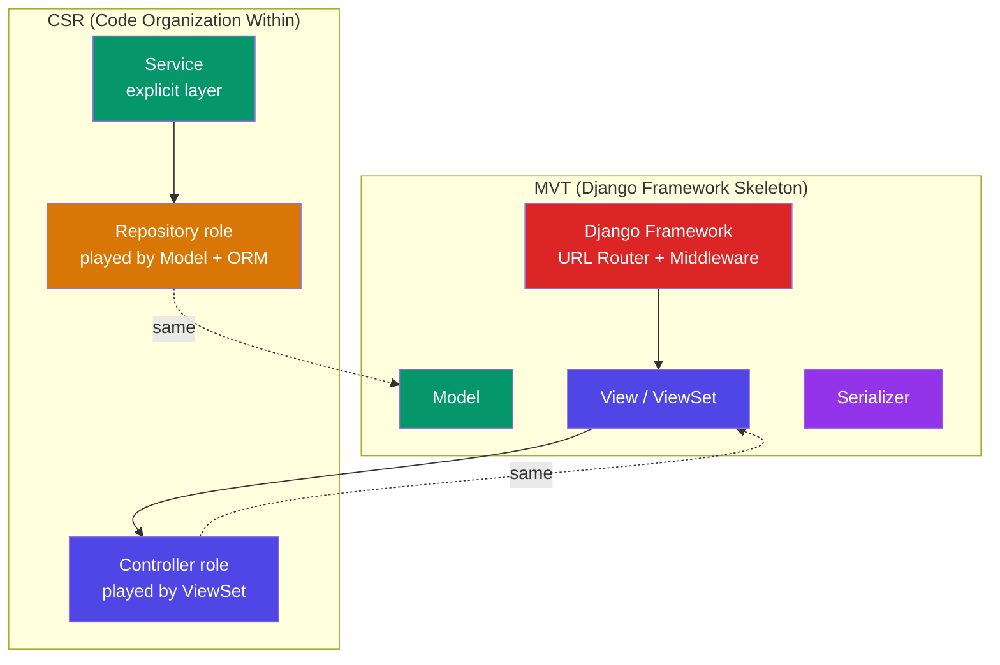

| Layer | MVT Name | CSR Role It Plays | Our Code |
|-------|----------|-------------------|---------|
| Entry point | **View** (ViewSet) | **Controller** | `ChatSessionViewSet` — receives HTTP, validates, delegates |
| Business logic | *(not in standard MVT)* | **Service** | `ChatSessionService` — our explicit addition |
| Data access | **Model** | **Repository** | `ChatSession` + Django ORM — queries + schema |
| Output formatting | **Template** (Serializer) | *(no CSR equivalent)* | `ChatSessionSerializer` — formats JSON response |
| Routing | **Django Framework** | *(no CSR equivalent)* | `DefaultRouter` + `urls.py` |

### The One-Liner Distinction

> **CSR tells you HOW to organize your code** (Controller receives, Service thinks, Repository stores). **MVT tells you WHERE Django puts each piece** (View handles requests, Model stores data, Template formats output). They're not rivals — CSR is the principle, MVT is Django's implementation of it.

---

## 6. MVT in Our Project — The Real Code

Now let's map the generic MVT pattern to our actual codebase.

### The Full MVT + Service Stack

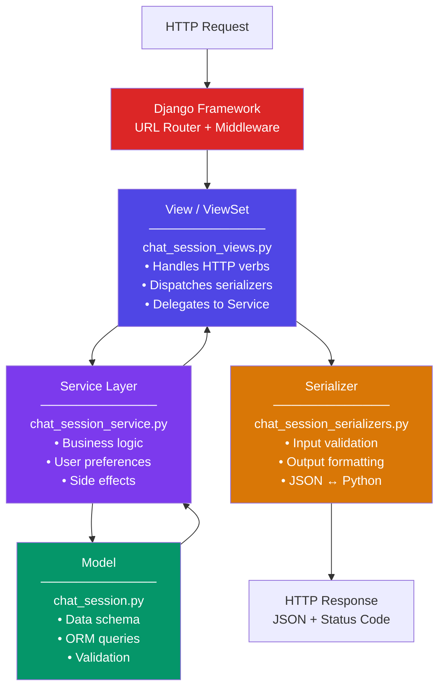

### MVT Mapping — Generic → Django → Our Code

| MVT Component | Generic Role | Django Implementation | Our Code |
|--------------|-------------|---------------------|---------|
| **Model** | Data + rules + persistence | `models.Model` subclass | `ChatSession(TimestampedModel)` |
| **View** | Request handler + coordinator | `viewsets.ModelViewSet` | `ChatSessionViewSet` |
| **Template** | Output formatting | `serializers.ModelSerializer` | `ChatSessionSerializer` |
| **Framework** | URL routing + middleware | Django + DRF | `urls.py` + `DefaultRouter` |
| **Service** *(our addition)* | Business logic | Custom service classes | `ChatSessionService` |

### Concrete Example: Create Chat Session

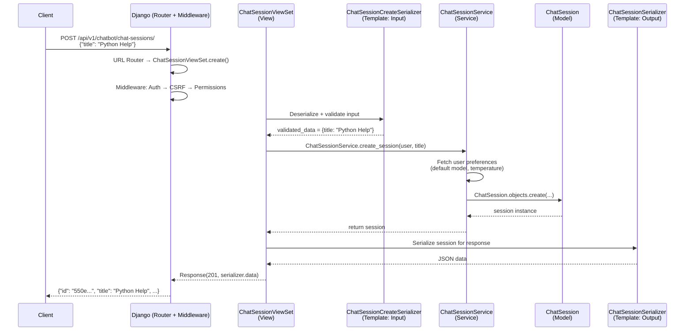

### The Code at Each Layer

**Model** — The data structure:

```python
# apps/chatbot/models/chat_session.py
class ChatSession(TimestampedModel):
    id = models.UUIDField(primary_key=True)
    user = models.ForeignKey(CustomUser, on_delete=models.CASCADE)
    title = models.CharField(max_length=255)
    model_name = models.CharField(max_length=100)
    temperature = models.FloatField(default=0.7)
    is_active = models.BooleanField(default=True)
    # ... more fields
```

**View** — The request handler:

```python
# apps/chatbot/api/views/chat_session_views.py
class ChatSessionViewSet(viewsets.ModelViewSet):
    queryset = ChatSession.objects.all()
    serializer_class = ChatSessionSerializer

    def get_serializer_class(self):
        return {"create": ChatSessionCreateSerializer,
                "list": ChatSessionListSerializer,
                }.get(self.action, ChatSessionSerializer)

    def perform_create(self, serializer):
        session = ChatSessionService.create_session(
            user=self.request.user,
            **serializer.validated_data
        )
        serializer.instance = session
```

**Template (Serializer)** — The output formatter:

```python
# apps/chatbot/api/serializers/chat_session_serializers.py
class ChatSessionSerializer(serializers.ModelSerializer):
    thread_id = serializers.CharField(read_only=True)
    user_email = serializers.SerializerMethodField()

    class Meta:
        model = ChatSession
        fields = ["id", "thread_id", "title", "model_name", ...]
        read_only_fields = ["id", "user", "created_at"]

class ChatSessionCreateSerializer(serializers.ModelSerializer):
    class Meta:
        model = ChatSession
        fields = ["title", "model_name", "temperature"]
```

**Service** — The business logic:

```python
# apps/chatbot/services/chat_session_service.py
class ChatSessionService:
    @staticmethod
    def create_session(user, title="New Conversation", ...):
        prefs = user.ai_preferences
        session = ChatSession.objects.create(
            user=user,
            title=title,
            model_name=model_name or prefs.default_model,
            temperature=temperature or prefs.default_temperature,
        )
        return session
```

### Why We Added a Service Layer

Standard MVT has 3 layers. We have 4. Here's why:

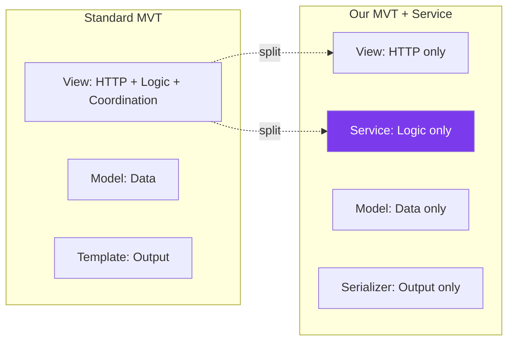

| Without Service | With Service |
|----------------|-------------|
| Business logic lives in View | View is thin (HTTP only) |
| Can't reuse logic across View + WebSocket + Celery | Same service called from anywhere |
| Hard to unit test business logic | Service methods are pure, testable |
| Fat views, skinny models | Skinny everything |

---

## 7. Key Takeaways

### 🏗️ The Build-Up

```
1. Request-Response Cycle    →  How the web works (universal)
2. CSR Pattern               →  How backends organize code (Controller → Service → Repository)
3. MVC Pattern               →  How servers separate concerns (Model → View → Controller)
4. Django MVT                →  How Django adapts MVC (Model → View → Template)
5. MVT vs CSR                →  They're NOT substitutes — CSR is the principle, MVT is Django's implementation
6. MVT + Service             →  How OUR project extends Django (Model → View → Serializer → Service)
```

### 🧠 Mental Model

```
┌───────────────────────────────────────────────────────────────────────┐
│                                                                       │
│   UNIVERSAL:  Client → Request → Server → Response                    │
│                                                                       │
│   CSR:        Controller → Service → Repository → Database            │
│               (each layer has ONE job, dependencies go ↓)             │
│                                                                       │
│   MVC:        Controller → Model → View                               │
│               (data + logic + presentation separated)                 │
│                                                                       │
│   Django MVT: View → Model → Template                                 │
│               (Django Framework = The Controller)                     │
│                                                                       │
│   MVT + CSR:  ViewSet(Controller) → Service → Model(Repo) → Serializer│
│               (CSR principle inside MVT skeleton)                     │
│                                                                       │
└───────────────────────────────────────────────────────────────────────┘
```

### 📐 The Naming Trap

| You Hear | In Django It Means | Don't Confuse With |
|----------|-------------------|-------------------|
| "View" | Request handler (= MVC Controller = CSR Controller) | MVC View (= Django Template) |
| "Template" | Output formatter (= MVC View) | Django View (= MVC Controller) |
| "Controller" | Django Framework itself | A class you write (you don't) |
| "Serializer" | API Template (renders JSON) | HTML template |
| "CSR" | Controller-Service-Repository | Client-Side Rendering (different CSR!) |
| "Model" | Data schema + ORM queries | CSR Repository (queries only, no schema) |

### 🎯 One-Liner Summary

> **The web is Request → Process → Response. CSR tells you HOW to organize code (Controller receives, Service thinks, Repository stores). MVC tells you WHAT to separate (data, logic, presentation). Django's MVT is MVC with renamed parts. Our project uses CSR principles inside Django's MVT skeleton.**

---

*Next: [02 — Authentication & JWT Deep Dive](./02_authentication_jwt_deep_dive.md)*